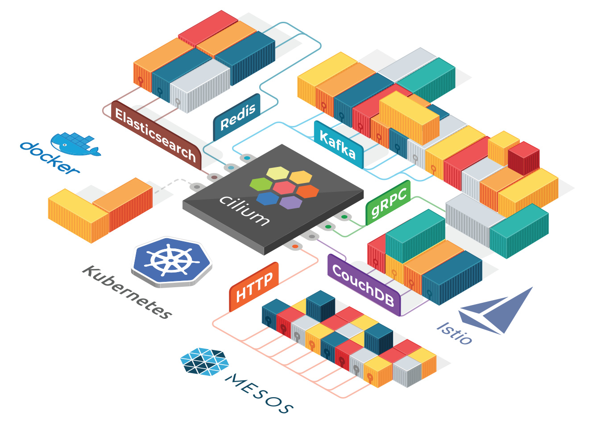
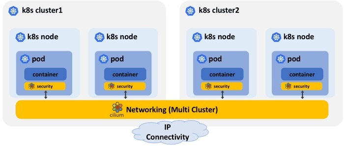

我们很高兴地宣布推出Cilium 1.2。该版本引入了几个新功能实现了Cilium用户和社区成员最迫切想要的功能。其中最吸引人的功能之一是引入基于DNS 名称的安全策略，目的是保护对集群外服务的访问。另一个最受关注的问题是加入了连接和保护多个Kubernetes集群的能力。我们将ClusterMesh功能进入Alpha版本。它可以连接和保护在多个Kubernetes集群中运行的pod。Kube-router与Cilium的集成同等重要。DigitalOcean团队的努力使kube-router提供BGP网络与Cilium提供的基于BPF的安全性和负载均衡相结合。整个Cilium开发者社区贡献者总数已增加到85个，在1.1到1.2版本内贡献了579个PR。

#### Cilium是什么？

Cilium是一个开源软件，用于在Kubernetes、Docker和Mesos等Linux容器管理平台部署的应用程序服务之间提供透明连接、保护网络和API。


Cilium是基于一种叫BPF的新内核技术，它使得能够在Linux自身内部动态插入强大的安全性、可见性和网络控制逻辑。除了提供传统的网络级安全性之外，BPF的灵活性还可以在API和进程级别实现安全性，以保护容器或pod内的通信。

有关Cilium的更详细的介绍，请参阅[Cilium简介](http://docs.cilium.io/en/v1.1/intro/)部分。

#### 1.2版本的重要功能

- 基于DNS/FQDN的安全策略
  - 基于FQDN/DNS命名定义网络安全规则，表示允许连接到外部服务。例如，允许访问foo.com。（处于Beta版）
- 支持AWS EKS
  - 为管理Kubernetes集成量身定制的etcd operator，消除了对需要外部kvstore的依赖。（处于Beta版）
- Clustermesh（集群间连接）
  - 跨多个Kubernetes集群的pod间网络连接。（处于Alpha版）
  - 跨集群的基于label的网络安全策略实施，例如允许cluster1中的pod foo与cluster2中的pod bar通信。
- 为支持BPF集成Kube-route
  - 与kube-router一起协作运行以启用BGP网络。
- 基于节点发现的KV存储
  - 在非Kubernetes环境中启用自动节点发现。
- 负载均衡
  - 支持一致的后端selection用于服务后端扩缩容
  - 支持基于服务label/name的策略以及L4规则
- 高效性 & 扩缩容
  - 对于大型和多集群规模的环境，安全身份认证空间从16bits增加到24bits。
  - 首次实现基于BPF的数据路径通知聚合。
  - 取得持续高效的CPU利用进展。
  - 自动检测underlying网络的MTU。
  - 禁用DSR时使用本地service ID分配以提高负载均衡可伸缩性。
- 文档
  - 新的AWS EKS安装指南。
  - 参考kubespray安装指南。
  - 新的简化安装和升级说明。

#### 基于DNS的安全策略

在Kubernetes集群中运行的服务通常与集群外部的一系列服务进行交互。常见示例包括SaaS服务，如S3、RDS、DynamoDB等。基于API的服务，例如Google地图、Salesforce API、Twilio等。或自托管服务，如Oracle数据库集群、基于Windows的应用程序等。到目前为止，Cilium支持基于CIDR的策略，以便与此类外部服务进行交互。然而，基于CIDR的策略很难定义和维护，因为服务的IP地址可能经常发生变化。Cilium 1.2现在支持基于DNS名称的特定策略。当前实现支持基于其FQDN的白名单外部服务的核心实例。考虑到DNS解决方案（例如TTL、CNAME等）和相关策略要求（例如`*.google.com`等基于通配符的规范）的复杂性，对于基于DNS的综合策略，后续版本中还有更多工作要做。

#### 示例：允许访问my-remote-service.com

下面的简单示例演示了如何定义网络安全策略，该策略允许所有label为`app = test-app`的pod通过kube-dns解析DNS名称，并向服务`my-remote-service.com`发出外部请求：

```yaml
apiVersion: "cilium.io/v2"
kind: CiliumNetworkPolicy
metadata:
  name: "to-fqdn-example"
spec:
  endpointSelector:
    matchLabels:
      app: test-app
  egress:
    - toFQDNs:
        - matchName: "my-remote-service.com"
    - toEndpoints:
      - matchLabels:
          "k8s:io.cilium.k8s.policy.serviceaccount": kube-dns
          "k8s:io.kubernetes.pod.namespace": kube-system
          "k8s:k8s-app": kube-dns
      toPorts:
      - ports:
        - port: "53"
          protocol: UDP
```

Cilium将自动维护相应的基于CIDR的规则，以允许所有pod与所有为该DNS名称返回的IP地址进行通信。

#### 支持AWS EKS

按照[AWS EKS上使用etcd operator的新指南](http://docs.cilium.io/en/v1.2/kubernetes/install/eks/)，在AWS EKS托管的Kubernetes集群上安装Cilium。

安装指南为Cilium提供全新的集成etcd operator，以管理自己的etcd集群。在许多情况下，Kubernetes使用的etcd无法被Cilium使用。例如，在管理的Kubernetes中，例如EKS、GKE、AKS等。可以有限地访问Kubernetes etcd服务。在Cilium 1.2中，我们使用了一个etcd operator，它将安装和管理一个高度可用的etcd集群供Cilium使用。这将使Cilium的安装和使用变得更加容易，而不依赖于Kubernetes等，并且不需要对etcd集群进行额外管理。我们正在积极致力于AKS整合，并将在未来几周内发布关于如何在GKE上运行的指南。如果您有任何问题或需要帮助，请使用[Slack](http://cilium.io/slack)联系。

#### ClusterMesh：跨多个Kubernetes集群的网络连通和安全性

运行多个Kubernetes集群变得越来越普遍。运行在不同可用区或Regions服务的高可用实例；在多个集群中运行的point-of-presence，服务于不同的地理位置；组织原因如分离PCI与非PCI兼容服务；或者简单地分离dev、test和prod工作负载。

运行多个Kubernetes集群的基本要求之一是如何连接服务以及如何为跨集群交互保证东西流量安全。在Cilium 1.2中，我们将引入多集群中不请求ingress controller或者负载均衡实现不同集群pod之间连接的能力。由于pod间可以直接交互，因此Cilium能够保留其身份认证并对东西向流量实施完整的L3/L4和L7访问控制。



Cilium使用去中心化的方式创建Cluster Mesh并建立pod身份认证，而不是为所有集群使用单个集中式etcd。用这种方式，每个集群都能独立管理它们pod的身份。每个集群都被赋予一个独立的标识作为身份命名空间。因此pod身份成为集群身份+ pod身份的组合。这种方法易于管理和扩展，而不用协调所有集群中的身份。这种方式与多集群高可用目标保持一致，每个集群的生命周期独立于其他集群的生命周期。查看[多集群安装指南](https://cilium.readthedocs.io/en/stable/install/guides/clustermesh/)试着体验Cilium cluster-mesh。

#### BGP支持：基于Kube-router + Cilium


Kube-router是一个由cloudnativelabs倡议，旨在满足各种Kubernetes网络需求并提供统一的解决方案。从数据转发的角度来看，Kube-router使用BGP来广播和管理集群中所有pod的路由。通过与外部路由器进行BGP配对，Kube-router可以轻松地在Kubernetes pod与集群外部运行的服务之间建立连接。此外，Kube-router创建服务时告知cluster IP，这意味着可以使用单个cluster IP和标准端口从集群外部访问服务。

由DigitalOcean团队领导的社区工作，Cilium现已集成Kube-router，整合了BPF和基于BGP路由。查看[使用kube-router运行BGP指南](http://docs.cilium.io/en/v1.2/kubernetes/install/kube-router/)去了解如何并行运行kube-router和Cilium以运行拥有Cilium L3-L7策略和负载均衡的BGP网络。

#### 支持Istio 1.0


Istio 1.0发布了快一个月了。Cilium已与Istio完美集成，可为Service Mesh架构提供高效的数据转发以及L3/L4和L7安全性。我们在博客 中详细介绍了这一点[Istio 1.0：Cilium如何通过socket感知BPF程序增强Istio](http://www.servicemesher.com/blog/how-cilium-enhances-istio-with-socket-aware-bpf-programs/)。Cilium 1.2包含了与Istio 1.0集成的几项改进。

#### 可扩展性和高效

同样，通过在各种环境中大量分析Cilium性能指标和并优化连接跟踪和其他关键数据结构的操作，继续大力改进已经很好的可扩展性并提高CPU效率。如果您想了解更多，请在[Slack](http://cilium.io/slack)上跟我们联系。

#### 升级说明

同样，请按照[指南升级](https://cilium.readthedocs.io/en/v1.2/install/upgrade/#upgrading-minor-versions)升级你的Cilium deployment。随意在[Slack](http://cilium.io/slack)上联系我们。

#### 发布

- 容器镜像：

```bash
docker.io/cilium/cilium:v1.2.0
```
