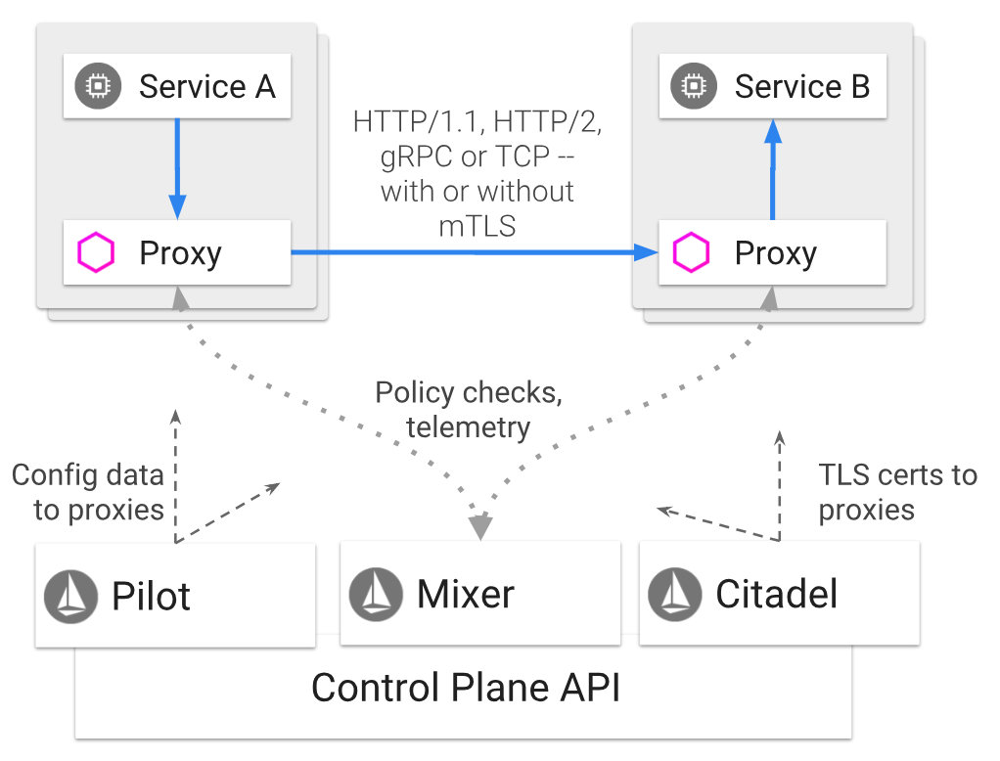

Istio 服务网格架构的概述，通常都是从对数据面和控制面的叙述开始的。

来自 Istio 的文档：

Istio 服务网格逻辑上分为数据平面和控制平面。

数据平面由一组以 sidecar 方式部署的智能代理（Envoy）组成。这些代理和 Mixer（一个通用的策略和遥测中心）合作，对所有微服务之间的之间所有的网络通信进行控制。

控制平面负责管理和配置代理来路由流量。此外控制平面配置 Mixer 以实施策略和收集遥测数据。



Sidecar 注入到应用的过程，可以是自动的，也可以是手动的，了解这一过程是很重要的。应用的流量会被重定向进入或流出 Sidecar，开发人员无需关心。应用接入 Istio 服务网格之后，开发者可以开始使用网格功能并从中受益。然而数据平面是如何工作的，以及需要怎样的条件才能完成这种无缝工作？本文中我们会深入到 Sidecar 注入模型中，来更清晰的了解 Sidecar 的注入过程。

## Sidecar 注入

简单来说，注入 Sidecar 就是把附加的容器配置插入 Pod 模板的过程。Istio 服务网格所需的附加容器是：

```bash
istio-init
```

这个[初始化容器](https://kubernetes.io/docs/concepts/workloads/pods/init-containers/)用于设置 `iptables` 规则，让出入流量都转由 Sidecar 进行处理。和应用容器相比，初始化容器有几点不同：

- 它在应用容器之前启动，并且会运行到结束。
- 如果有多个初始化容器，只有在前一个初始化容器成功结束之后才会启动下一个。

不看看出，这种容器是非常适合执行启动或者初始化任务的，并且也无需和实际的应用容器集成到一起。`istio-init` 只是用来设置 `iptables` 的规则。

```bash
istio-proxy
```

这个容器是真正的 Sidecar（基于 Envoy）。

### 手工注入

要进行手工注入，只要用 `istioctl` 把前面提到的两个容器定义加入到 Pod 的模板之中即可。不论是手工注入还是自动注入，都是从 `istio-sidecar-injector` 以及 `istio` 两个 Configmap 对象中获取配置的。

我们先来看看 `istio-sidecar-injector` Configmap，了解一下其中的内容。

```bash
$ kubectl -n istio-system get configmap istio-sidecar-injector -o=jsonpath='{.data.config}'
部分输出内容：

policy: enabled
template: |-
  initContainers:
  - name: istio-init
    image: docker.io/istio/proxy_init:1.0.2
    args:
    - "-p"
    - [[ .MeshConfig.ProxyListenPort ]]
    - "-u"
    - 1337
    .....
    imagePullPolicy: IfNotPresent
    securityContext:
      capabilities:
        add:
        - NET_ADMIN
    restartPolicy: Always

  containers:
  - name: istio-proxy
    image: [[ if (isset .ObjectMeta.Annotations "sidecar.istio.io/proxyImage") -]]
    "[[ index .ObjectMeta.Annotations "sidecar.istio.io/proxyImage" ]]"
    [[ else -]]
    docker.io/istio/proxyv2:1.0.2
    [[ end -]]
    args:
    - proxy
    - sidecar
    .....
    env:
    .....
    - name: ISTIO_META_INTERCEPTION_MODE
      value: [[ or (index .ObjectMeta.Annotations "sidecar.istio.io/interceptionMode") .ProxyConfig.InterceptionMode.String ]]
    imagePullPolicy: IfNotPresent
    securityContext:
      readOnlyRootFilesystem: true
      [[ if eq (or (index .ObjectMeta.Annotations "sidecar.istio.io/interceptionMode") .ProxyConfig.InterceptionMode.String) "TPROXY" -]]
      capabilities:
        add:
        - NET_ADMIN
    restartPolicy: Always
    .....
```

如你所见，这个 Configmap 中包含了前面提到的两个容器的配置内容：`istio-init` 初始化容器以及 `istio-proxy` 代理容器。配置中包含了容器镜像名称以及一些参数，例如拦截模式，权限要求等。

从安全角度看来，要注意 `istio-init` 需要 `NET_ADMIN` 权限，以便在 Pod 的命名空间中修改 `iptables`；如果 `istio-proxy` 设置为 `TPROXY` 模式，也会需要这一权限。这一权限是限制在 Pod 的命名空间之内的，这应该没问题。然而我注意到最近的 open-shift 版本好像在这方面有点问题，需要进一步确认。这方面的选项会在文末继续讨论。

要修改当前的 Pod 模板来进行注入，可以：

```bash
 $ istioctl kube-inject -f demo-red.yaml | kubectl apply -f -
```

或者

想要使用修改过的 Configmap 或者本地 Configmap：

- 从 Configmap 中创建 `inject-config.yaml` and `mesh-config.yaml`：

  ```bash
  $ kubectl -n istio-system get configmap istio-sidecar-injector -o=jsonpath='{.data.config}' > inject-config.yaml
  $ kubectl -n istio-system get configmap istio -o=jsonpath='{.data.mesh}' > mesh-config.yaml
  ```

- 修改现存的 Pod 模板，这里假设文件名为 `demo-red.yaml`：

  ```bash
  $ istioctl kube-inject --injectConfigFile inject-config.yaml --meshConfigFile mesh-config.yaml --filename demo-red.yaml --output demo-red-injected.yaml
  ```

- 提交 `demo-red-injected.yaml`：

  ```bash
  $ kubectl apply -f demo-red-injected.yaml
  ```

上面的几个步骤中，我们使用 `sidecar-injector` 以及 `istio` 两个 Configmap 的内容修改了 Pod 模板并使用 `kubectl` 命令进行了提交。如果查看一下注入后的 YAML 文件，会看到前面讨论过的 Istio 的专属容器，提交到集群上之后，会看到两个容器在运行：一个是实际的应用容器，另一个则是 `istio-proxy` Sidecar。

```bash
$ kubectl get pods | grep demo-red

demo-red-pod-8b5df99cc-pgnl7   2/2       Running   0          3d
```

这里没有 3 个 Pod，这是因为 `istio-init` 容器是一个初始化容器，它完成任务之后就会退出——他的任务就是设置 Pod 内的 `iptables` 规则。要确认退出的初始化容器，可以看看 `kubectl describe` 的输出：

```bash
$ kubectl describe pod demo-red-pod-8b5df99cc-pgnl7

SNIPPET from the output:

Name:               demo-red-pod-8b5df99cc-pgnl7
Namespace:          default
.....
Labels:             app=demo-red
                    pod-template-hash=8b5df99cc
                    version=version-red
Annotations:        sidecar.istio.io/status={"version":"3c0b8d11844e85232bc77ad85365487638ee3134c91edda28def191c086dc23e","initContainers":["istio-init"],"containers":["istio-proxy"],"volumes":["istio-envoy","istio-certs...
Status:             Running
IP:                 10.32.0.6
Controlled By:      ReplicaSet/demo-red-pod-8b5df99cc
Init Containers:
  istio-init:
    Container ID:  docker://bef731eae1eb3b6c9d926cacb497bb39a7d9796db49cd14a63014fc1a177d95b
    Image:         docker.io/istio/proxy_init:1.0.2
    Image ID:      docker-pullable://docker.io/istio/proxy_init@sha256:e16a0746f46cd45a9f63c27b9e09daff5432e33a2d80c8cc0956d7d63e2f9185
    .....
    State:          Terminated
      Reason:       Completed
    .....
    Ready:          True
Containers:
  demo-red:
    Container ID:   docker://8cd9957955ff7e534376eb6f28b56462099af6dfb8b9bc37aaf06e516175495e
    Image:          chugtum/blue-green-image:v3
    Image ID:       docker-pullable://docker.io/chugtum/blue-green-image@sha256:274756dbc215a6b2bd089c10de24fcece296f4c940067ac1a9b4aea67cf815db
    State:          Running
      Started:      Sun, 09 Dec 2018 18:12:31 -0800
    Ready:          True
  istio-proxy:
    Container ID:  docker://ca5d690be8cd6557419cc19ec4e76163c14aed2336eaad7ebf17dd46ca188b4a
    Image:         docker.io/istio/proxyv2:1.0.2
    Image ID:      docker-pullable://docker.io/istio/proxyv2@sha256:54e206530ba6ca9b3820254454e01b7592e9f986d27a5640b6c03704b3b68332
    Args:
      proxy
      sidecar
      .....
    State:          Running
      Started:      Sun, 09 Dec 2018 18:12:31 -0800
    Ready:          True
    .....
```

从上文的输出可以看出，`istio-init` 容器的 `State` 字段值为 `Terminated`，`Reason` 是 `Completed`。正在运行的两个 Pod 是应用容器 `demo-red` 以及 `istio-proxy`。

### 自动注入

多数时候，用户不想在每次部署应用的时候都用 `istioctl` 命令进行手工注入，这时候就可以使用 Istio 的自动注入功能来应对了。只要给用于部署应用的命名空间打个 `istio-injection=enabled` 标签就可以了。

打上标签之后，这个命名空间中新建的任何 Pod 都会被 Istio 注入 Sidecar。下面的例子里，`istio-dev` 命名空间中部署的 Pod 被自动注入了 Sidecar：

```bash
$ kubectl get namespaces --show-labels

NAME           STATUS    AGE       LABELS
default        Active    40d       <none>
istio-dev      Active    19d       istio-injection=enabled
istio-system   Active    24d       
kube-public    Active    40d       
kube-system    Active    40d       
```

这是怎么完成的呢？要回答这一问题，首先要了解一下 Kubernetes 的准入控制器。

来自 Kubernetes 文档

准入控制器是一段代码，会拦截 Kubernetes API Server 收到的请求，拦截发生在认证和鉴权完成之后，对象进行持久化之前。可以定义两种类型的 Admission webhook：Validating 和 Mutating。Validating 类型的 Webhook 可以根据自定义的准入策略决定是否拒绝请求；Mutating 类型的 Webhook 可以根据自定义配置来对请求进行编辑。

Istio 的自动注入过程中会依赖 Mutating webhook。我们看看 `istio-sidecar-injector` 中的配置详情：

```bash
$ kubectl get mutatingwebhookconfiguration istio-sidecar-injector -o yaml

输出内容节选:

apiVersion: admissionregistration.k8s.io/v1beta1
kind: MutatingWebhookConfiguration
metadata:
  annotations:
    kubectl.kubernetes.io/last-applied-configuration: |
      {"apiVersion":"admissionregistration.k8s.io/v1beta1","kind":"MutatingWebhookConfiguration","metadata":{"annotations":{},"labels":{"app":"istio-sidecar-injector","chart":"sidecarInjectorWebhook-1.0.1","heritage":"Tiller","release":"istio-remote"},"name":"istio-sidecar-injector","namespace":""},"webhooks":[{"clientConfig":{"caBundle":"","service":{"name":"istio-sidecar-injector","namespace":"istio-system","path":"/inject"}},"failurePolicy":"Fail","name":"sidecar-injector.istio.io","namespaceSelector":{"matchLabels":{"istio-injection":"enabled"}},"rules":[{"apiGroups":[""],"apiVersions":["v1"],"operations":["CREATE"],"resources":["pods"]}]}]}
  creationTimestamp: 2018-12-10T08:40:15Z
  generation: 2
  labels:
    app: istio-sidecar-injector
    chart: sidecarInjectorWebhook-1.0.1
    heritage: Tiller
    release: istio-remote
  name: istio-sidecar-injector
  .....
webhooks:
- clientConfig:
    service:
      name: istio-sidecar-injector
      namespace: istio-system
      path: /inject
  name: sidecar-injector.istio.io
  namespaceSelector:
    matchLabels:
      istio-injection: enabled
  rules:
  - apiGroups:
    - ""
    apiVersions:
    - v1
    operations:
    - CREATE
    resources:
    - pods
```

这里可以看到一个 `namespaceSelector`，其中的定义表明它的工作是针对带有 `istio-injection: enabled` 标签的命名空间的。这种情况下，你还会看到 Pod 创建期间进行注入时的一些其它工作和相关资源的内容。当 `apiserver` 收到一个符合规则的请求时，`apiserver` 会给 Webhook 服务发送一个准入审核的请求，Webhook 服务的定义包含在 `clientConfig` 配置中的 `name: istio-sidecar-injector` 字段里。我们会看到，这个服务正在 `istio-system` 命名空间里运行。

```bash
$ kubectl get svc --namespace=istio-system | grep sidecar-injector

istio-sidecar-injector   ClusterIP   10.102.70.184   <none>        443/TCP             24d
```

这个配置总体上来说，完成了我们手工注入所需完成的工作。只不过是它是在 Pod 创建的过程中自动完成的，所以你也不会看到 Deployment 对象发生了任何变化。可以用 `kubectl describe` 命令来查看 Sidecar 和初始化容器。如果想要修改注入逻辑，例如 Istio 自动注入的生效范围，可以编辑 `MutatingWebhookConfiguration`，然后重启 Sidecar injector Pod。

Sidecar 的自动注入过程除了根据 `namespaceSelector` 选择命名空间之外，还受到缺省注入策略以及 Pod 自身注解的影响。

再看看 `istio-sidecar-injector` ConfigMap 中的缺省策略定义。可以看到，缺省是启用的。

```bash
$ kubectl -n istio-system get configmap istio-sidecar-injector -o=jsonpath='{.data.config}'

SNIPPET from the output:

policy: enabled
template: |-
  initContainers:
  - name: istio-init
    image: "gcr.io/istio-release/proxy_init:1.0.2"
    args:
    - "-p"
    - [[ .MeshConfig.ProxyListenPort ]]
```

还可以在 Pod 模板中使用注解 `sidecar.istio.io/inject` 覆盖缺省策略。下面的例子中的 `Deployment` 用这种方式禁用了自动注入：

```yaml
apiVersion: extensions/v1beta1
kind: Deployment
metadata:
  name: ignored
spec:
  template:
    metadata:
      annotations:
        sidecar.istio.io/inject: "false"
    spec:
      containers:
      - name: ignored
        image: tutum/curl
        command: ["/bin/sleep","infinity"]
```

这个例子展示了很多可能性，可以从命名空间标签、ConfigMap 或者 Pod 中分别进行控制：

- Webhooks 定义中的 `namespaceSelector`（`istio-injection: enabled`）
- 缺省策略（在 ConfigMap `istio-sidecar-injector` 中定义）
- Pod 注解（`sidecar.istio.io/inject`）

注入状态表中，根据上面三个因素的不同，可以看到有不同的注入结果。

## 从应用容器到 Sidecar 代理的通信

现在我们知道了 Sidecar 容器和初始化容器被注入到应用中的过程了，Sidecar 代理是如何截获进出容器的流量呢？我们前面提到过，这是通过对 Pod 命名空间中 `iptable` 规则的设置来完成的，这个设置过程由 `istio-init` 容器来控制。现在可以看看命名空间中到底更新了些什么。

进入前面我们部署的应用 Pod 的命名空间，看看配置完成的 iptables。我会使用 `nsenter`。也可以用特权模式进入容器获得同样的信息。如果无法访问节点，可以用 `exec` 进入 Sidecar 来执行 `iptables` 指令。

```bash
$ docker inspect b8de099d3510 --format '{{ .State.Pid }}'

4125
$ nsenter -t 4215 -n iptables -t nat -S

-P PREROUTING ACCEPT
-P INPUT ACCEPT
-P OUTPUT ACCEPT
-P POSTROUTING ACCEPT
-N ISTIO_INBOUND
-N ISTIO_IN_REDIRECT
-N ISTIO_OUTPUT
-N ISTIO_REDIRECT
-A PREROUTING -p tcp -j ISTIO_INBOUND
-A OUTPUT -p tcp -j ISTIO_OUTPUT
-A ISTIO_INBOUND -p tcp -m tcp --dport 80 -j ISTIO_IN_REDIRECT
-A ISTIO_IN_REDIRECT -p tcp -j REDIRECT --to-ports 15001
-A ISTIO_OUTPUT ! -d 127.0.0.1/32 -o lo -j ISTIO_REDIRECT
-A ISTIO_OUTPUT -m owner --uid-owner 1337 -j RETURN
-A ISTIO_OUTPUT -m owner --gid-owner 1337 -j RETURN
-A ISTIO_OUTPUT -d 127.0.0.1/32 -j RETURN
-A ISTIO_OUTPUT -j ISTIO_REDIRECT
-A ISTIO_REDIRECT -p tcp -j REDIRECT --to-ports 15001
```

上面展示的内容中，可以清楚的看到，所有从 80 端口（`red-demo` 应用监听的端口）进入的流量，被 `REDIRECTED` 到了端口 `15001`，这是 `istio-proxy`（Envoy 代理）监听的端口。外发流量也是如此。

本文进入尾声。希望能够让读者了解到 Istio 将 Sidecar 注入到 Pod 中的过程，以及 Istio 将流量路由到代理服务器的过程。

更新：在 `istio-init` 阶段，现在有了一个新的使用 CNI 的方式，这种方式无需初始化容器的帮助，也不需要对应的权限。[`istio-cni`](https://github.com/istio/cni) 插件会设置 Pod 的网络来满足这一要求，可以代替 `istio-init` 来完成任务。
