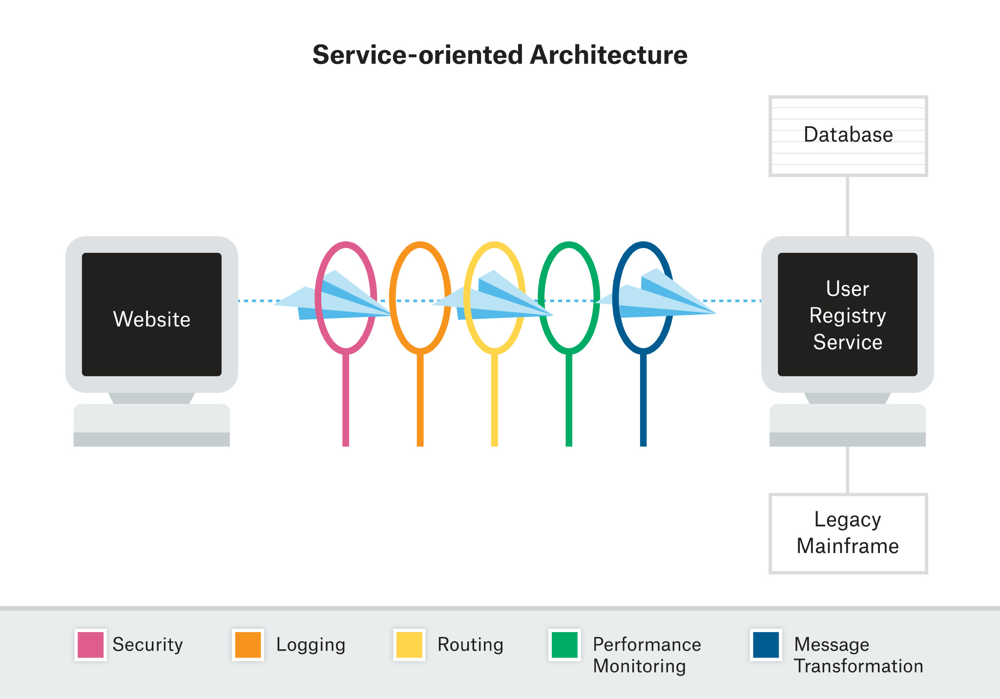
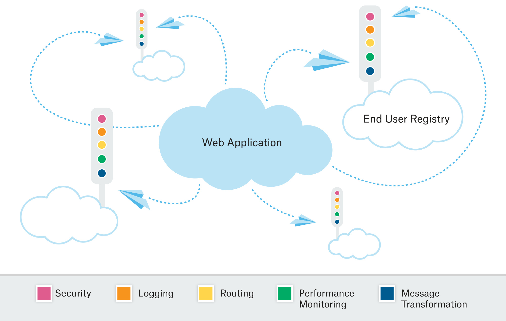

在Istio和相关技术持续获得增势之时，中间件在Service Mesh中的地位正在逐渐减弱。尽管它们都可以用来监管不同应用和服务之间的通信，但是在运维和范式方面却大不相同。在今天以容器为中心的世界里，面向服务的架构体系盛行，中间件会变得无关紧要吗？

## 中间件

[中间件](https://searchmicroservices.techtarget.com/definition/middleware)将应用和它底层的数据库连接起来，因此常被称作“软件胶水”。它将客户端的网络请求连接到后端数据，通过将所有消息聚合到一个管道中来实现通信。中间件在这个管道中整合一些关键功能，包括安全验证、日志记录、路由、性能监控和消息转换。中间件以传统的方式整合面向服务架构（[SOA](https://searchmicroservices.techtarget.com/definition/service-oriented-architecture-SOA)）应用的通信，后者由可复用的组件组成或者是一个单体应用。

如下图所示，中间件的工作方式，是将不同应用的消息汇总到中心化的通信节点。然后将这些消息传递到一系列功能管道，直到“用户注册”服务。消息通过企业服务总线（ESB）进行传输。这种通信方式便于隐藏分布式系统的多样性、硬件和操作系统的差异性。

随着企业组织持续拥抱容器化，传统中间件的一些问题开始变得愈加明显。DevOps实践鼓励基于分布式系统的现代环境，以及快速、自动化部署的不可变实例。容器的持续集成和持续交付（CI/CD）要求不断地更新应用和工具，而ESB对比并不友好。

单点故障（Single-points-of-failure）：中间件以服务日志级别，记录和监控所有服务的消息，并保存在一个巨大的、中心化的日志系统中。它针对所有的消息都执行特定的功能，特别是日志记录和性能监控。消息被排队处理，任何故障都可能导致管道拥堵。要发现一个问题，可能需要从上千个无关的潜在错误中进行筛选。中间件实现通信的方式，有可能在记录服务日志时发生单点故障，一个小问题就能中断所有的通信。

单体应用（Monolithic）：尽管SOA由松耦合、可复用的组件组成，中间件的统一管道难以为之做出调整。中间件所整合的功能与它们自身和周围的应用紧密集成在一起，UI上的小变化甚至需要重新评估整个应用。中间件提供了一种通用的通信方式，在这方面它是有效的，但是这需要创建隔离网络的命令式编程。

容器化和虚拟化大大增加了应用中部署的实例数量，这也增加了发生单点故障时的拥堵风险，并且需要更加动态的变化。服务网格方案，如Istio、Ambassador和Envoy，正越来越多地被视为替代方案。

## 服务网格

[服务网格](https://containerjournal.com/2018/07/27/introducing-a-security-mesh-to-protect-kubernetes/)是一个位于服务层之上的专用网络层，用于服务间通信。它的通信管道基于分布式APIs，而不是中心化、离散化的应用。

消息在服务网格内传输，但是消息传递功能在接收消息的服务旁侧执行，每个实例被附加了一个用于在服务网格中来回传递消息的代理。这些代理执行一些传统上由中间件执行的功能，比如消息路由、消息阻塞、服务发现、负载均衡、加解密、认证和授权。此外，它们也支持错误处理、熔断、请求追踪等特性。

服务网格允许在服务间直接发送消息，而不再通过中间管道。这使得应用的消息传递跟它的服务耦合在一起，而这在大多数中心化应用中是松耦合的。服务网格分布式的特性减轻了单点故障的依赖，并促进了动态变化。

容器化：服务网格在许多方面都是容器化的理想选择。它们是平台无关的，并且可以被集成到任何基于容器的体系架构中。它们消除了单点故障，可以从网络故障或服务故障中快速恢复。通过消息分发，它们使得容器化的可伸缩性和声明式编程更加容易。**[服务网格支持容器化朝着高度易变的环境发展](https://devcentral.f5.com/articles/how-containers-scale-service-mesh-versus-traditional-architecture-27705)。基于这些原因，产生了越来越多的决策，使用诸如Istio之类的工具，将中间件的计算能力带入到Kubernetes和基于容器的系统。**

[Istio](https://www.cloudops.com/tag/istio/)是一个可以提供对服务网格的操作控制和行为洞察力的解决方案。它基于Envoy代理而构建。ELK、Kibana和EFK可以为Istio提供可观察性和可监控性。

## 中间件的终结？

随着服务网格越来越多的被采纳，它们发展的非常迅速。最近，Istio发布了1.0版本，表明服务网络正变得更加稳定和安全。Envoy已经加入云原生计算基金会（[CNCF](https://www.cncf.io/)），Istio也正在计划加入。服务网格解决方案正在发展成为蒸蒸日上的云原生生态系统，并且被用于云原生应用。

但是，有些确定的用例场景仍然得益于稳定而安全的中间件。中间件已经存在了数十年，知道如何操作它的人比知道如何操作服务网格的人更多。另外，已经有些长期存在的、被证实过的措施用于确保中间件的安全性，并遵守相关规范，如HIPPA、PIPEDA和PCI DSS。

[服务网格正在迅速地变得更加安全](http://blog.christianposta.com/how-a-service-mesh-can-help-with-microservices-security/)，但是容器安全与虚机安全有着不同的思维。除此之外，它依赖于将运维过程集成到开发阶段。在整个技术栈的实施过程中，DevOps实践促进了应用的安全、敏捷和长期演化。在实施DevOps方法论和相关流程的过程中，云原生工具已经成功起到了显著作用。

**如果组织架构希望使用服务网格替代某些中间件，则必须重新评估其组织流程和方法论。**尽管服务网格有助于多个容器间的通信，中间件仍然是单体应用间消息传递的理想选择。它们构建在不同的范例中，组织机构可能不得不从根本上改变他们构建应用和基础设施的方式，并且支持做出变化。

在DevOps工具和实践框架落实到位之前，组织机构并不能撤下部分遗留中间件。这将促进技术栈的基础设施（如代码、服务、安全性、监控和CI/CD）之间的动态协同。应用的中间件或者服务网格必须反映它们之间进行通信的组件。

DevOps转型将有助于确保组织的文化和决策过程与其使用工具进行创新的速度保持一致。联系我们，[了解如何改变、支持和发展您的DevOps和云原生实践。](mailto: info@cloudops.com)

