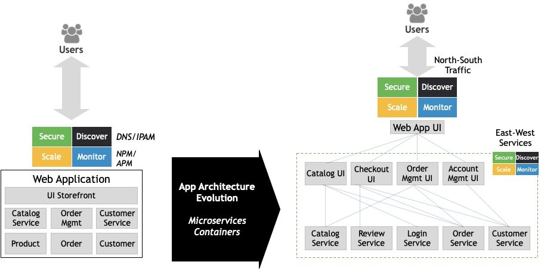
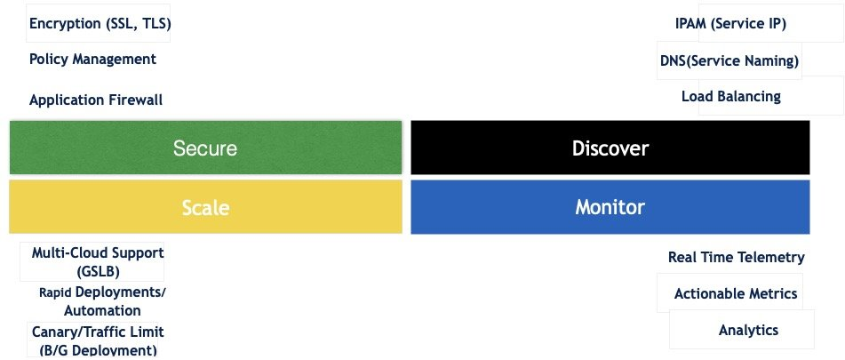
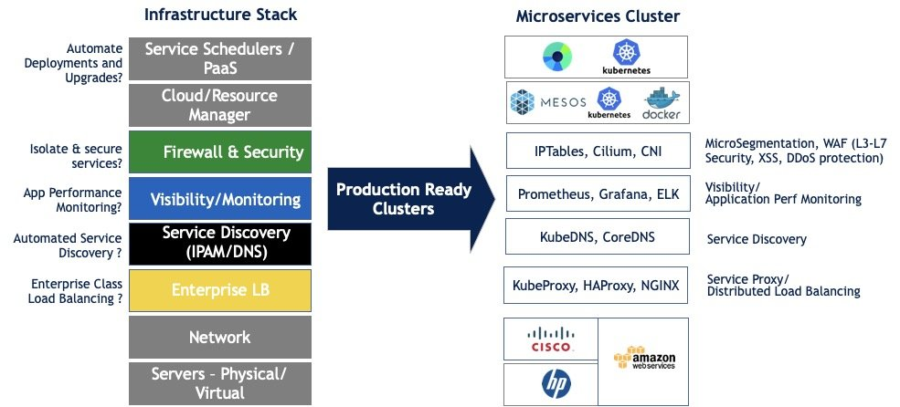

在过去几年中，我们注意到应用程序架构正在迅速转变为分布式微服务架构——单体和庞大的应用程序被分解为更小的单个服务，其可被独立修改、构建、部署和管理。这种模式的主要优点就是简洁和快速，同时由于其对其他服务的依赖性很小或者完全没有依赖，更易于升级和独立扩展。这与敏捷和DevOps理念非常吻合，这种模式也已经被许多规模化的Web公司成功采用。过去的许多年中，这些公司中的大多数都能够很好地采用这种模式，但是近几年中成功将这种模式发扬光大的两大推手非Docker和Kubernetes莫属。Docker简化了将微服务构建为Linux容器的过程，Kubernetes则能够以资源优化的方式来部署、管理和扩展服务。

## 应用架构演进

在这篇博客中，我们不会花太多时间讨论微服务架构的优缺点。相反，我们将专注于在向基于微服务构建的云原生架构的重大转变上。

虽然微服务架构提供了灵活性，但其也带有复杂性。Kubernetes在部署和管理微服务方面发挥了非常重要的作用，但我们需要的不仅仅是单一的运行在生产环境中的云原生应用程序——还需要在服务发现、安全性、流量管理等方面需要更加深入的了解。尤其是在相互通信的成千上百个服务经常被删除、生产、扩展和更新的复杂环境下，深入的了解更加有必要性。

## 微服务架构面临的挑战

这种规模化和动态化对于早期运行单体程序和管理应用程序的基础设施带来了具体的转变。为支持这种动态环境，新一代架构需要在生态系统中补充大量的新技术。为了交付所有的用户场景，我们需要在基础架构栈的每个级别上提供多个解决方案。根据需要，基础架构人员开始将这些技术集成到平台上，但这也意味着程序开发人员需要额外的负担来支持这些技术。

## 基础架构栈高层视图

这不是人们所期望的，并且也绝对不是微服务架构做出的的敏捷性、易于开发和部署的承诺。

此后出现了服务网格的理念，这也是Avi Networks在此术语被创造之前一直专注于为客户提供的内容，并且由Istio和Linkerd等开源项目推动下形成了事实上的标准。我们很高兴看到社区热情拥抱了服务网格，而且我们也认为服务网格是微服务基础架构的必要组成部分。

那么什么是 “服务网格” ，其如何帮助解决这些问题的呢？服务网格实质上是提供了上面图中在基础架构中的多层服务，与此同时程序开发者无需集成或修改代码就可以利用这些服务。它不仅使服务之间的通信快速可靠，而且服务网络还提供细粒度的流量管理、故障恢复、安全（加密、授权和认证）和可观察性（如跟踪、日志和监控）。所有这些都是从使用某种架构的开发人员中抽象出来的，其中所有服务间的通信都流经sidecar代理，代理与每个服务一起部署，从而创建一个服务网格。Sidecar由集中控制平面管理配置，用于流量路由和策略实施。尽管运行与应用程序容器一样多的sidecar容器一直是争论的焦点，但服务网格的优势和功能似乎超过了运维问题。

在本博客系列的其余部分，我将深入探讨如何实现服务网格，并使用Istio的参考架构来完成旅程，因为Istio是当前最广泛使用和最知名的服务网格解决方案之一。但Istio是否解决了所有问题，并且在处理当今微服务世界中存在的重要场景方面是否完整？我们将深入探讨这一点，并在本系列的后续部分讨论所有内容。 敬请关注！

Manish Chugtu - CTO Cloud Infrastructure和Microservices@Avi Networks，是一位创新思想领军人物，在架构，设计和产品开发方面拥有 18 年以上的经验，在架构和开发高度可扩展的企业解决方案方面拥有丰富的经验。目前，他致力于推动Avi在容器和云基础架构领域的战略， [他的 LinkedIn](https://www.linkedin.com/in/manishchugtu/)。
