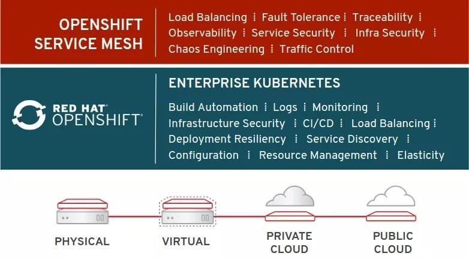
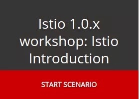

Red Hat的OpenShift服务网格技术预览版上线，基于Istio。

软件开发实践的进步与软件交付中的技术改进相结合导致了组织中的应用程序实例数量激增。无论它们是基于“macro”的还是单体的，“迷你”服务还是微服务，随着服务数量的增加交互的数量和复杂性都会显著增加。

到目前为止，管理这些复杂服务交互的大部分负担都放在了应用程序开发人员身上。像[Netflix Common Runtime Services & Libraries](https://netflix.github.io/)这样的库集的发展为应用程序弹性、流量控制等带来了许多特性和优势。但是这些库与运行时相关，比如Netflix的库是基于Java的，开发人员必须将它们集成到应用程序中。

**网格**

服务网格概念将这些责任推给了基础架构，从而消除了开发人员的负担。当底层基础架构负责流量管理、可观察性、策略实施和服务身份/安全性时，开发人员就可以专注于业务价值本身。开发人员不用再花费时间将库集成到应用程序中。然后，基础设施运营团队负责维护网格基础设施，作为日常维护和管理实践的一部分。

几年来，Red Hat一直通过Red Hat OpenShift产品系列支持Kubernetes作为其容器编排解决方案。关于服务网格和Kubernetes、[Istio](https://www.redhat.com/en/blog/connecting-and-managing-microservices-istio-10-kubernetes)项目和社区，其目标是将是“完全开源的服务网格，透明地分层到现有的分布式应用程序上。”

**现在可以在Red Hat OpenShift上使用服务网格技术预览**

Red Hat还是[Istio项目的早期采用者和贡献者](https://blog.openshift.com/red-hat-istio-launch/)。我们与上游社区合作，帮助它达到1.0里程碑，目标是红帽将使Istio正式成为OpenShift平台的一部分。今天，我们为Red Hat OpenShift上的Istio开始了一个技术预览计划。 [此预览](https://docs.openshift.com/container-platform/3.10/servicemesh-install/servicemesh-install.html)适用于Red Hat OpenShift Platform 3.10。

技术预览计划将为现有的OpenShift Container Platform客户提供在其OpenShift集群上部署和使用Istio平台的能力。红帽正在提供此计划，旨在收集反馈和经验，同时我们期望在2019自然年提供OpenShift上Istio的全面支持和全面可用性。

参与技术预览计划无需特殊流程、注册或其他形式。Istio以一组容器镜像的方式提供，可以使用Operator选择性地安装到OpenShift集群中。运维人员还可以从现有集群中卸载Istio。

**限制和范围**

Istio技术预览计划旨在通过Istio功能的某个子集收集客户反馈和经验。

- 断路器
- 故障注入
- 监测/追踪
- 高级路由规则

由于Envoy sidecar的初始化仍然需要在技术预览期间进行特权访问，因此安装了Istio的任何OpenShift集群都可能无法获得Red Hat的生产支持。虽然我们希望尽快通过OpenShift Service Mesh使Istio可用，但有兴趣参与技术预览的客户此时不应尝试在生产集群中使用。

**默认开启**

按照Red Hat的惯例，我们围绕Istio的工作也是开源的。Red Hat正在与上游Istio社区合作，以帮助推进Istio框架，并创建了一个名为[Maistra](http://maistra.io/)的社区项目，我们专注于OKD中上游Istio框架的特定集成需求和OpenShift一样，就像OpenShift的上游社区一样[OKD](https://www.okd.io/)。

**你还在等什么？**

您是OpenShift Container Platform的客户吗？如果是的话那还等什么呢？访问<https://docs.openshift.com/container-platform/latest/servicemesh-install/servicemesh-install.html>，其中提供了有关如何开始使用OpenShift Service Mesh技术预览的文档。

不是OpenShift客户？您可以在[这些教程](https://learn.openshift.com/servicemesh/)中了解有关OpenShift上的Istio的更多信息。

[了解Istio 1.0和它对您业务的价值。](https://learn.openshift.com/servicemesh/1-introduction)
