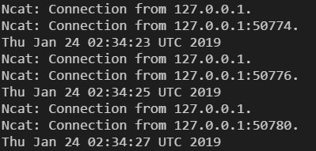
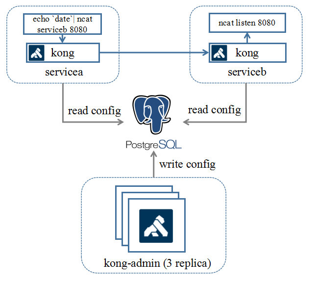
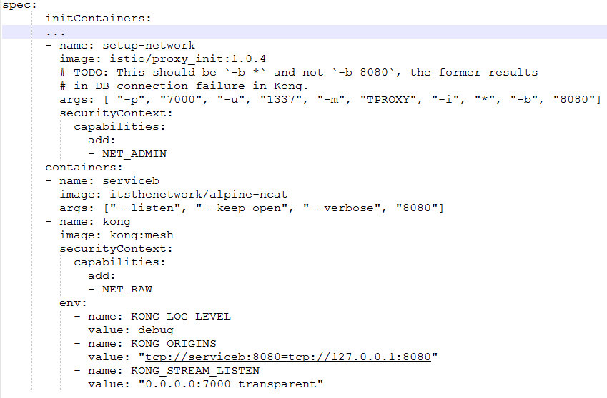
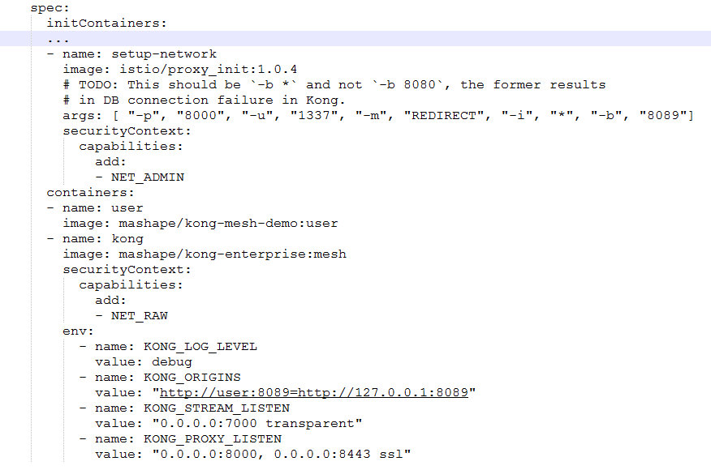
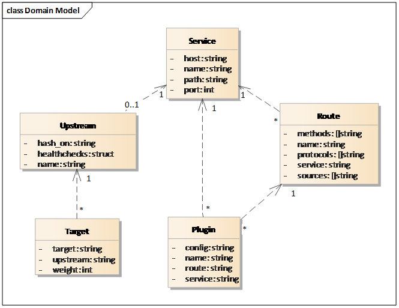

Kong是一个基于OpenResty (Nginx) 封装的微服务中间件产品，在微服务架构体系中，作为API网关以及API中间件（kubernetes ingress）提供服务。由于其天生具备Nginx的高性能、nginx-lua插件的可定制性，再加上完善的社区以及齐全的文档，在中小企业用户群非常受欢迎，拥有较好的群众基础。

2018年8月，kong发布了1.0 GA版本，正式宣布其支持service mesh，并提供社区版以及企业版2个版本。下面我们从Demo、配置、功能这3方面，对kong mesh进行体验及分析。

## Demo体验

Kong社区提供了kong mesh的demo (<https://github.com/Kong/kong-mesh-dist-kubernetes>），该demo是实现的是tcp四层透明代理转发业务。

该demo主要做的事情是：提供两个服务servicea以及serviceb，serviceb作为服务端，通过ncat监听8080端口，接受外部的TCP消息；servicea作为client端，通过ncat将当前server的时间发往serviceb。Demo的运行效果如下：

在客户端节点，每隔两秒会发送一次时间戳到服务端。

 

服务端节点，每隔两秒打印一次时间戳。



接下来，我们详细了解一下该demo背后的技术原理。

首先，我们来分析一下kong-mesh业务整体组网：

 
从组网中可以看出，kong mesh也分控制面与数据面。

控制面为图中kong-admin的POD，3副本实例独立部署，对外提供Admin API供用户设置各种规则配置。

数据面为图中servicea及serviceb的POD，每个POD中会启动一个kong容器作为sidecar，通过iptables规则将外发以及到达的流量劫持到kong容器中，然后kong会根据路由规则将流量转发到对应的实例。下面我们看看POD的部署配置：

 

部署配置关键点在于流量接管的设置，POD在启动应用前，会使用istio/proxy_init镜像来初始化环境，图中的参数的含义是，使用TProxy（透明代理）的流量接管模式，将发往8080端口（业务serviceb监听端口）的流量通过7000端口（kong监听端口）来进行代理。 

了解清楚该部署配置后，我们就可以比较容易地使用kong来代理http服务了。主要改动点还是在于POD的部署配置的修改。如下图所示： 

 

值得注意的是，代理HTTP服务和代替TCP不一样，属于7层转发，不能使用上文的透明代理方式来进行接管。因此在setup_network的启动参数中，需要指定流量接管模式为REDIRECT，通过iptables显式将报文导入到kong，kong再根据报文内容进行匹配后，再路由到目标服务（大家如果需要http demo的代码，可以到<https://github.com/andrewshan/kong-mesh-http-demo>下载）。

那么，kong又是根据什么规则去路由的呢？下面我们会继续体验kong mesh的配置规则。 

## 配置分析

kong mesh的配置集中存储在DB中，当前仅支持Postgre以及cassandra。控制面kong-admin会把配置规则写入到DB中，数据面的Kong会定期从数据库读取配置规则并更新缓存。 

在demo中，我们通过k8s Job向kong-admin写入了两条数据：  

```bash
http --ignore-stdin put kong-admin:8001/services/service-b host=serviceb port=8080 protocol=tcp -f  
http --ignore-stdin post kong-admin:8001/services/service-b/routes name=service-b sources[1].ip=0.0.0.0/0 protocols=tcp -f 
```

第一条语句是添加一个名字叫service-b的服务；

第二条语句是为service-b的服务添加路由规则，允许源ip在0.0.0.0/0网段的tcp包可以转发到service-b。 

规则添加后，分别在services和routes表中可以查询到相关的记录： 


那么问题来了，kong的规则模型具体是什么含义？这些规则是怎么组合工作的呢？ 
首先，我们先看看kong的规则模型：

 

从图上可见，Service是规则模型的核心，一个Service代表一个目标服务URL。

Route代表的是Service的细粒度路由规则，定义了根据不同的客户端请求属性来选择目标端Service，一个Service可关联多个Route规则。可类比istio中的VirtualService。

Upstream定义的是针对具体的目标Service，所采取的负载均衡策略，以及健康检查相关配置，一个Service可关联0-1个Upstream。可类比istio中的DestinationRule。 

Target定义的是具体的服务节点实例，可定义权重，一个target关联一个upstream。
具体的详细规则描述，可参考kong的官方文档：<https://docs.konghq.com/?_ga=2.44328420.1762329551.1548210642-1561229614.1544407768>。

在k8s环境下部署，如果直接使用k8s平台所提供的kube-dns的域名解析能力以及ClusterIP/NodePort的负载均衡的话，那么原则上只需要配置Service以及Route规则就可以进行工作。Upstream和Target属于可选配置。

我们继续看看，kong-mesh本身如何根据这些规则进行路由。 

 

Kong的路由及负载均衡能力是构建于openresty的access_by_lua以及balancer_by_lua这2个phase之上的。Servicea发送的请求通过iptables将流量导入到客户端侧（servicea-kong），kong收到后，根据请求消息进行route_match，找出匹配的目标service，然后再根据service的可用target进行负载均衡，找到目标serviceb节点实例进行发送。

服务端serviceb-kong收到请求后，由于启动前通过环境变量配置好了本地路由规则: 

```yaml
env:
  - name: KONG_ORIGINS
	value: "tcp://serviceb:8080=tcp://127.0.0.1:8080"
```

根据该规则，kong直接把target为serviceb:8080的请求直接投递给serviceb。最终完成整个请求路由过程。

接下来，我们再看看，kong基于上述的配置模型，可以提供什么样的功能，以及与其他mesh产品的差异点。

## 功能对比

下表将kong mesh (community）与当下热门的istio+envoy组合进行功能比较，大家可以了解一下相关的差异（相关数据来源于kong官网） 

| 功能点   | kong-mesh (community)                                        | istio + envoy                                                | 分析                                                         |
| -------- | ------------------------------------------------------------ | ------------------------------------------------------------ | ------------------------------------------------------------ |
| 服务发现 | 通过admin api添加服务，并只能发现通过api添加的服务           | 支持对接k8s, consul等注册中心进行服务发现                    | 从平台独立性来看，kong mesh占优; 从服务接管易用性来看，istio占优 |
| 服务协议 | 支持http, http2, websocket, stream                           | 支持http, http2, grpc, websocket, stream                     | istio+envoy占优                                              |
| 服务路由 | 支持根据源、目标地址，method、host、path、protocol等细粒度的路由 | 支持除左侧列举的所有能力外，还支持按header以及subset（标签）的路由 | istio+envoy占优                                              |
| 负载均衡 | 支持轮询、权重、一致性hash的负载均衡模式                     | 支持除左侧列举的所有负载均衡模式外，还支持随机、最低负载等模式 | istio+envoy占优                                              |
| 健康检查 | 支持主动健康检查以及被动健康检查（熔断）                     | 支持主动健康检查以及被动健康检查（熔断）                     | 基本对等                                                     |
| 安全     | 支持Certificate证书管理，支持JWT+TLS加密传输                 | 支持证书下发及更新，JWT+mTLS加密传输                         | 基本对等                                                     |
| 多用户   | 支持按consumer授权                                           | 支持RBAC用户-角色授权                                        | istio+envoy占优                                              |
| 故障注入 | 不支持                                                       | 支持                                                         | istio+envoy占优                                              |
| 监控统计 | 继承nginx的统计能力，支持按请求、连接、健康状态等维度的统计  | 支持更细粒度的比如按协议、Zone的统计                         | istio+envoy占优                                              |
| 可扩展性 | 背靠openresty，提供强大的自定义插件能力，使用lua进行开发     | 提供lua插件开发能力，但能力比较基础                          | kong mesh占优                                                |
| 学习曲线 | kong自身提供控制面和数据面能力，组网简单，纯lua语言上手较轻松 | istio+envoy一起至少4个组件，跨两种语言，上手较难             | kong mesh占优                                                |

总体上来看，kong mesh相对istio+envy在功能满足度上略占劣势，不过胜在简单、可扩展性强，社区活跃度高（stars稍多于istio），未来结合社区将功能补齐也不是难事。

## 总结

Kong作为一个从API网关演变而来的service mesh产品，背靠成熟的OpenResty，拥有不输istio+envoy的功能满足度、且社区活跃，版本更新较快（平均2周一个release），比较适合中小型团队以及以前kong的老用户试水service mesh。
