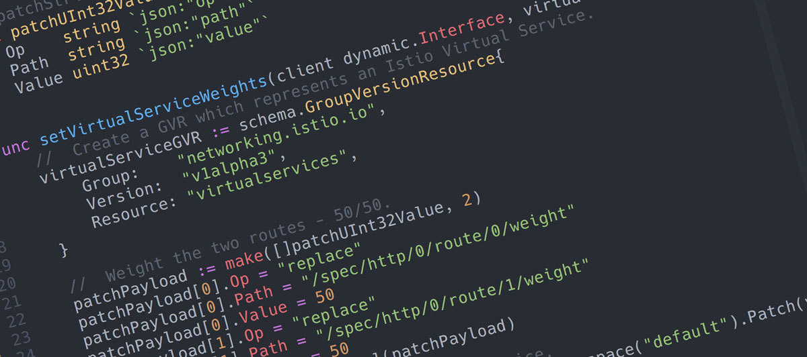
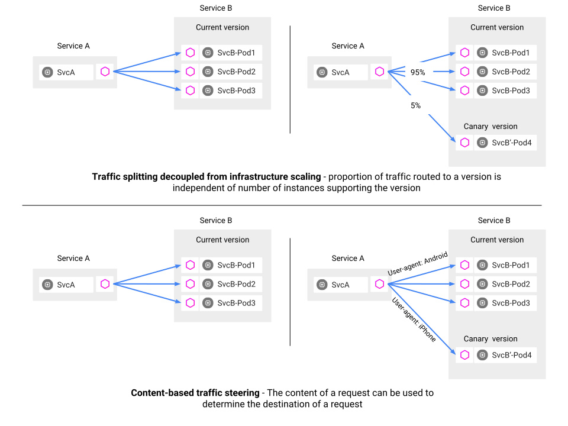

在本文中，我将演示如何使用Golang来操作Kubernetes Custom Resources，以Istio为例。 不需要您了解Istio，我只是用它来展示概念！



[Istio](https://istio.io/)是一个非常受欢迎的服务网格平台，它允许工程师快速地为基于服务的应用程序添加遥测技术、先进的流量管理等功能。

Istio工作原理的一个有趣的地方是，当部署到Kubernetes集群中时，许多关键配置对象被作为[自定义资源](https://kubernetes.io/docs/concepts/extend-kubernetes/api-extension/custom-resources/)处理。自定义资源是一个非常强大的Kubernetes特性，它允许您创建自己的”一等“资源（就像pod、副本、部署等），然后使用`kubectl`或Kubernetes API与它们进行交互。

在本文中，我将展示如何使用Golang Kubernetes client与这些自定义资源交互。

## CRD：快速概述

在为集群设置Istio时，您可能要做的一件常见的事情是指定如何路由通信。这可能相当复杂，如下所示:



[图1：来自istio.io的Istio流量管理示例](https://istio.io/docs/concepts/traffic-management/)

对于这样的系统，有一种配置方法就是使用一个ConfigMap，其中包含如何路由服务的定义。

然而，Istio实际上注册了新的资源类型（自定义资源定义），来表示网关或服务之类的对象。我们可以创建/更新/删除/操作这些资源类型，就像任何其他Kubernetes对象一样。

例如，我可以为上面的示例创建一个虚拟服务，如下所示:

```shell
cat << EOF | kubectl create -f -
```

```yaml
apiVersion: networking.istio.io/v1alpha3
kind: VirtualService
metadata:
  name: service2
spec:
  hosts:
  - "*"
  gateways:
  - demo1-gateway
  http:
  - route:
    - destination:
        host: service2
        subset: v1
      weight: 95
    - destination:
        host: service2
        subset: v2
      weight: 5
EOF
```

同样，重要的不是这个资源的具体内容，而是我可以像对待其他Kubernetes对象一样对待Istio资源:

```shell
$ kubectl get virtualservices.networking.istio.io
NAME       AGE
service2   93s
```

或者：

```shell
$ kubectl delete virtualservices.networking.istio.io/service2
```

甚至还可以使用`edit`、`describe`、注册生命周期事件、监视更改等等操作。

## 使用go语言操作CRD

使用[Golang Kubernetes Client](https://github.com/kubernetes/client-go)可以创建强定义的类型，然后就可以使用这些类型与CRD交互。红帽博客文章[Kubernetes Deep Dive: Code Generation for Custom Resources](https://blog.openshift.com/kubernetes-deep-dive-code-generation-customresources/)就是一个例子。

这是一种非常好的方法，但是如果您想快速访问一些数据，而又不想生成大量代码，那么这种方法会让您感到非常吃力。

还有一种替代方法，即使用`DynamicClient`。首选的方法似乎是第一种方法，它涉及到代码生成，因此第二种方法的文档很少。然而，第二种方法其实很简单。

下面这个例子介绍如何列出所有Istio VirtualService资源，而无需生成任何代码:

```go
import (
	metav1 "k8s.io/apimachinery/pkg/apis/meta/v1"
	"k8s.io/client-go/dynamic"
)

//  Create a Dynamic Client to interface with CRDs.
dynamicClient, _ := dynamic.NewForConfig(config)

//  Create a GVR which represents an Istio Virtual Service.
virtualServiceGVR := schema.GroupVersionResource{
	Group:    "networking.istio.io",
	Version:  "v1alpha3",
	Resource: "virtualservices",
}

//  List all of the Virtual Services.
virtualServices, _ := dynamicClient.Resource(virtualServiceGVR).Namespace("default").List(metav1.ListOptions{})
for _, virtualService := range virtualServices.Items {
	fmt.Printf("VirtualService: %s\n", virtualService.GetName())
}
```

为了清晰起见，这段代码省略了设置和错误处理，完整的示例在[k8s-list-virtualservices.go](https://gist.github.com/dwmkerr/09ac0fd98595460456e17d5ef0c77667)。

## 使用go语言修改CRD

您可能已经注意到，代码`.Resource().Namespace().List()`与Kubernetes `Clientset`进行API调用时使用的结构非常相似。实际上，本质上是一样的。看看[接口](https://github.com/kubernetes/client-go/blob/master/dynamic/interface.go)，你可以看到所有你想要的操作:

- `Create`
- `Update`
- `Delete`
- `Get`

等等。这很好，因为您可以像我的文章'[Patching Kubernetes Resources in Golang](https://www.dwmkerr.com/patching-kubernetes-resources-in-golang/)'中那样使用相同的技巧来操作这些实体，而无需创建表示它们的结构。

下面是另一个简短的例子，这次展示了如何将服务的路由的权重调整到50%/50%:

```go
import (
	metav1 "k8s.io/apimachinery/pkg/apis/meta/v1"
	"k8s.io/client-go/dynamic"
)

//  Create a GVR which represents an Istio Virtual Service.
virtualServiceGVR := schema.GroupVersionResource{
	Group:    "networking.istio.io",
	Version:  "v1alpha3",
	Resource: "virtualservices",
}

//  Weight the two routes - 50/50.
patchPayload := make([]PatchUInt32Value, 2)
patchPayload[0].Op = "replace"
patchPayload[0].Path = "/spec/http/0/route/0/weight"
patchPayload[0].Value = 50
patchPayload[1].Op = "replace"
patchPayload[1].Path = "/spec/http/0/route/1/weight"
patchPayload[1].Value = 50
patchBytes, _ := json.Marshal(patchPayload)

//  Apply the patch to the 'service2' service.
_, err := dynamicClient.Resource(virtualServiceGVR).Namespace("default").Patch("service2", types.JSONPatchType, patchBytes)
```

请参阅 [k8s-patch-virtualservice.go](https://gist.github.com/dwmkerr/7332888e092156ce8ce4ea551b0c321f)中的完整示例。

运行示例后，您可以使用Kubernetes CLI来验证更改:

```shell
$ kubectl get virtualservices.networking.istio.io/service2 -o yaml
```

```yaml
apiVersion: networking.istio.io/v1alpha3
kind: VirtualService
metadata:
  clusterName: ""
  creationTimestamp: 2018-10-08T09:53:16Z
  generation: 0
  name: service2
  namespace: default
  resourceVersion: "487435"
  selfLink: /apis/networking.istio.io/v1alpha3/namespaces/default/virtualservices/service2
  uid: fac5930c-cadf-11e8-90a2-42010a94005b
spec:
  gateways:
  - demo1-gateway
  hosts:
  - '*'
  http:
  - route:
    - destination:
        host: service2
        subset: v1
      weight: 50
    - destination:
        host: service2
        subset: v2
      weight: 50
```

## 保持简单！

就是这样！这个技巧使我正在做的事情变得简单了很多，但是需要做一些实验才能得到正确的结果。我希望你觉得这个方法有用，请在评论中分享你的想法与问题。

## 进一步阅读

在采用这种方法时使用了以下几篇文章:

- [Red Hat: Deep Dive: Code Generation for Custom Resources](https://blog.openshift.com/kubernetes-deep-dive-code-generation-customresources/)
- [Kubernetes Docs: Custom Resources](https://kubernetes.io/docs/concepts/extend-kubernetes/api-extension/custom-resources/)
