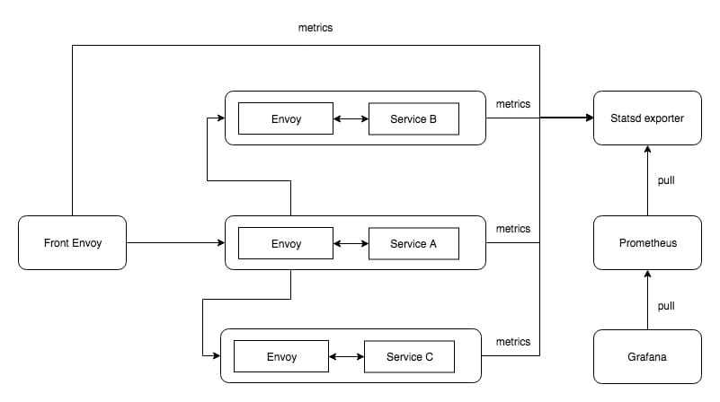

如果你刚接触“Service Mesh“和“Envoy”，我[这里](https://medium.com/@dnivra26/service-mesh-with-envoy-101-e6b2131ee30b)有一篇文章可以帮你入门。

这是**Envoy service mesh下的可观测性**系列的第二篇文章，你可以在[这里](https://medium.com/@dnivra26/distributed-tracing-with-envoy-service-mesh-jaeger-c365b6191592)阅读第一篇关于分布式追踪的文章。

在微服务中谈及监控时，你可不能被蒙在鼓里，至少要知道问题出在哪儿了。

让我们看看Envoy是怎样帮助我们了解我们的服务运行状况的。在service mesh下，所有的通信都会通过mesh，这意味着没有任何服务会与其它服务直接通信，服务向Envoy发起调用请求，然后Envoy将调用请求路由到目标服务，所以Envoy将持有传入和传出流量的上下文。Envoy通常提供关于[传入](https://www.envoyproxy.io/docs/envoy/latest/configuration/http_conn_man/stats)请求、[传出](https://www.envoyproxy.io/docs/envoy/latest/configuration/cluster_manager/cluster_stats)请求和[Envoy实例状态](https://www.envoyproxy.io/docs/envoy/latest/configuration/statistics)的指标。

## 准备

这是我们将要构建的系统概览。



## Statsd

Envoy支持通过两到三种格式来暴露指标，但本文中我们将使用[statsd](https://github.com/b/statsd_spec)格式。

所以流程将是这样，首先Envoy推送指标到statsd，然后我们用[prometheus](https://github.com/prometheus)（一个时序数据库）从statsd拉取指标，最后通过[grafana](https://github.com/grafana/grafana)可视化这些指标。

在准备概览图中，我提到了statsd exporter而不是statsd，这是因为我们并不会直接使用statsd，而是使用一个接收statsd格式数据，并将其以prometheus格式输出的转换器（服务）。下面让我们来搞定它吧。

Envoy的指标主要分为两类：

1. Counter（计数器）：一个只增不减的指标。如：请求总数
2. Gauge（量表）：一个可增可减的指标，类似于一个瞬时值。如：当前CPU使用量

让我们看一个包含stats sink的Envoy配置

```yaml
---
admin:
  access_log_path: "/tmp/admin_access.log"
  address: 
    socket_address: 
      address: "127.0.0.1"
      port_value: 9901
stats_sinks:
  -
    name: "envoy.statsd"
    config:
      tcp_cluster_name: "statsd-exporter"
      prefix: front-envoy    
static_resources: 
  listeners:
    - 
      name: "http_listener"
      address: 
        socket_address: 
          address: "0.0.0.0"
          port_value: 80
      filter_chains:
          filters: 
            - 
              name: "envoy.http_connection_manager"
              config:
                use_remote_address: true
                add_user_agent: true
                access_log:
                - name: envoy.file_access_log
                  config:
                    path: /dev/stdout
                    format: "[ACCESS_LOG][%START_TIME%] \"%REQ(:METHOD)% %REQ(X-ENVOY-ORIGINAL-PATH?:PATH)% %PROTOCOL%\" %RESPONSE_CODE% %RESPONSE_FLAGS% %BYTES_RECEIVED% %BYTES_SENT% %DURATION% %RESP(X-ENVOY-UPSTREAM-SERVICE-TIME)% \"%REQ(X-FORWARDED-FOR)%\" \"%REQ(USER-AGENT)%\" \"%REQ(X-REQUEST-ID)%\" \"%REQ(:AUTHORITY)%\" \"%UPSTREAM_HOST%\" \"%DOWNSTREAM_REMOTE_ADDRESS_WITHOUT_PORT%\"\n"
                stat_prefix: "ingress_443"
                codec_type: "AUTO"
                generate_request_id: true
                route_config: 
                  name: "local_route"
                  virtual_hosts: 
                    - 
                      name: "http-route"
                      domains: 
                        - "*"
                      routes: 
                        - 
                          match: 
                            prefix: "/"
                          route:
                            cluster: "service_a"
                http_filters:
                  - 
                    name: "envoy.router"
  clusters:
    -
      name: "statsd"
      connect_timeout: "0.25s"
      type: "strict_dns"
      lb_policy: "ROUND_ROBIN"
      hosts:
        -
          socket_address:
            address: "statsd_exporter"
            port_value: 9125
    - 
      name: "service_a"
      connect_timeout: "0.25s"
      type: "strict_dns"
      lb_policy: "ROUND_ROBIN"
      hosts:
        - 
          socket_address: 
            address: "service_a_envoy"
            port_value: 8786
```

第8-13行告诉Envoy我们需要statsd格式的指标、我们的统计信息前缀（通常是你的服务名）是什么和statsd sink的地址。

第55-63行配置了我们的环境中的statsd sink。

这就是让Envoy输出统计信息所需要的所有配置。现在让我们来看看第2-7行做了哪些事情：

1. Envoy在9901端口暴露了一个管理端，你可以通过它动态地改变日志级别，查看当前配置、统计数据等
2. Envoy也可以生成与nginx类似的访问日志，你可以通过它了解服务间的通信状况。访问日志的格式也是可配置的，如第29-33行

你需要将相同的配置添加到系统中的其它Envoy sidecar上（是的，每个服务都有自己的Envoy sidecar）。

这些服务本身是用go写的，它们做的事情很简单，仅仅是通过Envoy调用其它服务。你可以在[这里](https://github.com/dnivra26/envoy_monitoring)查看服务和Envoy的配置。

现在，虽然我们只有图中的statsd exporter，但有了它，如果我们运行docker容器（docker-compose build & docker-compose up），然后向Front Envoy（localhost:8080）发送一些流量，Envoy 将把这些流量的指标发送到statsd exporter，随后statsd exporter会把这些指标转换成prometheus格式，并将其暴露在9102端口。

Statsd exporter中的统计信息格式如下图所示


这里边将有上百个指标，同时，在上面的截图中我们能看到Service A和Service B之间的通信延迟指标。上图的指标是遵循prometheus格式的

```
metric_name ["{" label_name "=" `"` label_value `"` { "," label_name "=" `"` label_value `"` } [ "," ] "}"] value [ timestamp ]
```

你可以在[这里](https://github.com/prometheus/docs/blob/master/content/docs/instrumenting/exposition_formats.md)了解更多。

## Prometheus

我们将使用[Prometheus](https://prometheus.io/)作为时序数据库来保存我们的指标。Prometheus不仅是一个时序数据库，它本身还是一个监控系统，但本文我们只用它来存储指标数据。需要注意的是，prometheus是一个通过主动拉取来获取指标的系统，这意味着你必须告诉prometheus从何处拉取指标，在我们的例子中是从statsd exporter处拉取。

将Prometheus添加到系统中非常简单而又直接，我们只需要将拉取目标（statsd exporter）作为配置文件传递给Prometheus就可以了。配置看起来是这样的

```yaml
global:
  scrape_interval:  15s
scrape_configs:
  - job_name: 'statsd'
    scrape_interval: 5s
    static_configs:
      - targets: ['statsd_exporter:9102']
        labels:
          group: 'services'
```

scrape_interval的值表示Prometheus从目标处拉取配置的频率。

现在启动Prometheus，里面应该有一些数据了。让我们打开localhost:9090来看一看


如图所示，可以看到我们的指标。你能做的可不仅仅是选择已有的指标，从[这里](https://prometheus.io/docs/prometheus/latest/querying/basics/)可以阅读关于prometheus查询语言的更多信息。它还可以基于查询结果绘制图表，除此之外还有一个报警系统。

如果我们打开prometheus的targets页面，将能看到所有的拉取目标和它们的健康状态


## Grafana

Grafana是一个很棒的监控可视化解决方案，它支持Prometheus，Graphite，InfluxDB，ElasticSearch等多种后端。

Grafana有两大主要组件需要我们配置

(1). 数据源（Datasource）：指定grafana从哪个后端获取指标。你可以通过配置文件来配置数据源，代码如下所示

```yaml
apiVersion: 1

datasources:
  - name: prometheus
    type: prometheus
    access: Server
    url: http://prometheus:9090
    editable: true
```

(2). 仪表盘（Dashboard）：你可以从仪表盘查看来自数据源的指标。Grafana支持多种可视化元素，如Graphs，Single Stats，Heatmaps……你可以继承这些元素并使用插件来构造自己的元素。

我在使用Grafana时遇到的唯一一个问题是，缺少一种标准的方法来用代码开发那些仪表盘。所幸有一些第三方的库提供了支持，我们将使用来自weaveworks的[grafanalib](https://github.com/weaveworks/grafanalib)。

下面是我们通过 python 代码尝试构建的一个仪表盘

```python

from grafanalib.core import *
import os
dashboard = Dashboard(
    title="Services Dashboard",
    templating=Templating(
        [
            Template(
                name="source",
                dataSource="prometheus",
                query="metrics(.*_cluster_.*_upstream_rq_2xx)",
                regex="/(.*)_cluster_.*_upstream_rq_2xx/",
                default="service_a"
            ),
            Template(
                name="destination",
                dataSource="prometheus",
                query="metrics(.*_cluster_.*_upstream_rq_2xx)",
                regex="/.*_cluster_(.*)_upstream_rq_2xx/",
                default="service_b"
            )
        ]
    ),
    rows=[
        Row(
            panels=[
                Graph(
                    title="2XX",
                    transparent=True,
                    dataSource="prometheus",
                    targets=[
                        Target(
                            expr="[[source]]_cluster_[[destination]]_upstream_rq_2xx - [[source]]_cluster_[[destination]]_upstream_rq_2xx offset $__interval",
                            legendFormat="2xx"
                        )
                    ]
                ),
                Graph(
                    title="5XX",
                    transparent=True,
                    dataSource="prometheus",
                    targets=[
                        Target(
                            expr="[[source]]_cluster_[[destination]]_upstream_rq_5xx - [[source]]_cluster_[[destination]]_upstream_rq_5xx offset $__interval",
                            legendFormat="5xx"
                        ),
                    ]
                ),
                Graph(
                    title="Latency",
                    transparent=True,
                    dataSource="prometheus",
                    targets=[
                        Target(
                            expr="[[source]]_cluster_[[destination]]_upstream_rq_time",
                            legendFormat="{{quantile}}"
                        )
                    ]
                )
            ]
        ),
    ]
).auto_panel_ids()
```

在这段代码中，我们为2xx，5xx和延迟数据构建了图表。其中第5-22行很重要，它从我们的设置中提取可用的service names作为grafana的变量，为我们创建一个动态的仪表盘，这意味着我们能够选择性地查看特定源服务和目标服务的统计数据。如果想了解更多关于变量的内容请参考[这里](http://docs.grafana.org/reference/templating/)。

你需要通过grafanalib命令来从上述python文件生成仪表盘

```shell
     generate-dashboard -o dashboard.json service-dashboard.py
```

注意这里生成的dashboard.json可不容易阅读。

所以，启动Grafana时我们只需要传递仪表盘和数据源就好了。当访问http:localhost:3000时，你将看到：


现在你应该能看到2xx，5xx和延迟的图表，同时还能看到一个下拉菜单，你可以通过它选择源服务和目标服务。关于Grafana还有许多内容我们没有讨论到，包括强大的查询编辑器和告警系统。更重要的是，这一切都是可以通过插件和应用扩展的，可以参考[这里](https://github.com/grafana/kubernetes-app)的例子。如果你正想可视化常见服务如redis，rabbitmq等的指标，grafana有一个[公共仪表盘](https://grafana.com/dashboards)库，你只需要导入它们就可以使用了。使用Grafana 还有一个好处，你可以通过配置文件和代码创建和管理所有东西，而不需要过多地通过UI来操作。

我建议你试用一下prometheus和grafana以了解更多信息。感谢阅读，如有建议和意见，请写在评论中。

在[这里](https://github.com/dnivra26/envoy_monitoring/)可以找到所有代码和配置文件。
