今天我们不谈技术，不谈架构，也不谈具体的产品，我们来聊一聊在未来一两年之内，Service Mesh技术会在微服务相关的市场带来什么样的变化？

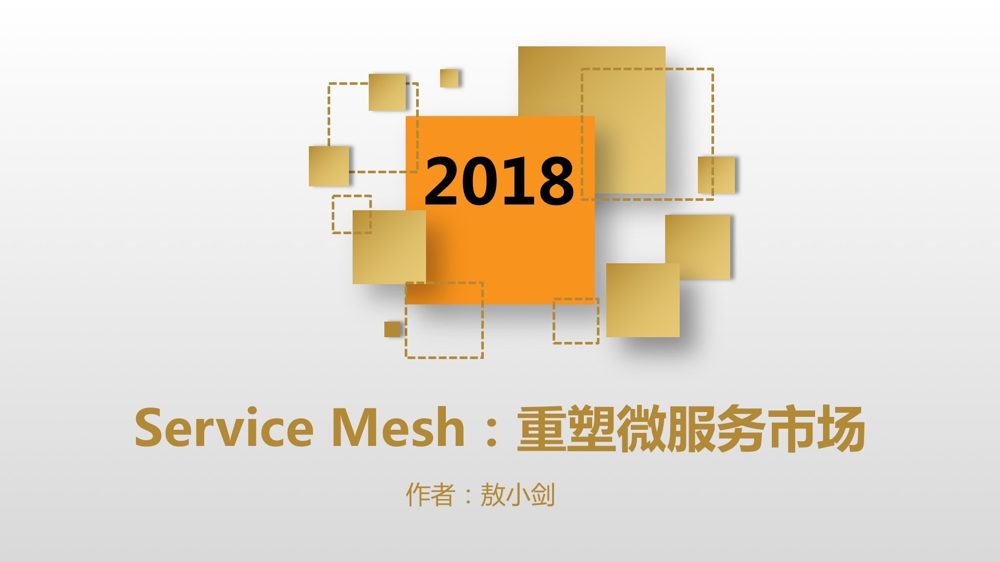

大家好，我是敖小剑，今天给大家带来的这个主题叫做 “Service Mesh：重塑微服务市场”。

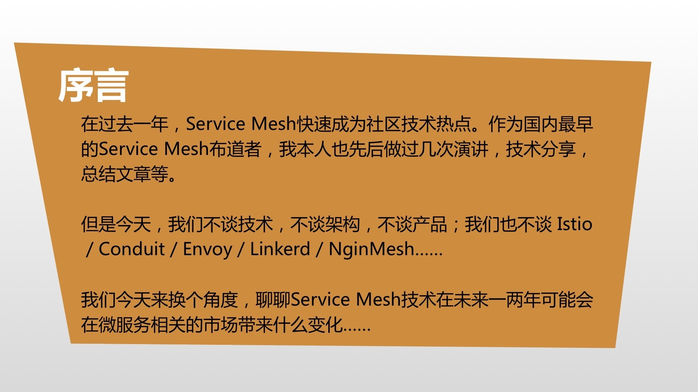

刚才主持人张亮提到说，过去一年Service Mesh成为一个热词。基本上，在国内的话，我差不多是Service Mesh最早的布道师。可能如果大家之前有看相关的资料的话，应该会看到一些我的资料。我先后做过几场的演讲，做过一些技术的分享，也写过很多文章。但在此之前，这些内容可能更多的都是集中在技术领域。那今天我们会特殊一点，我们今天不谈详细的技术，不谈具体的架构，我们也不谈具体的产品。后面的这些名词，Istio/Conduit/Envoy/Linkerd/Nginmesh，这些词可能听过，可能没听过，但没问题，今天这些我们统统都不讲。我们今天要讲另外一个东西：我们会聊一聊在未来一两年之内，Service Mesh技术会在微服务相关的市场带来什么样的变化？

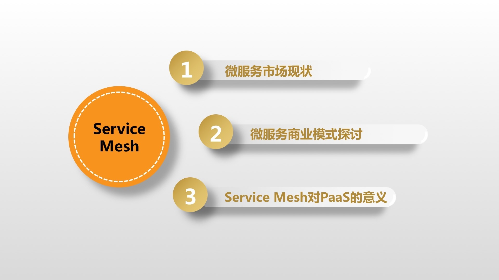

主要内容会是三大块：首先我们会看一下目前微服务的市场的一些现状，然后接下来我们会探讨一下它的商业模式，在第三块，我们会重点讲一下Service Mesh对PaaS的意义。

OK，第一块，微服务的现状。

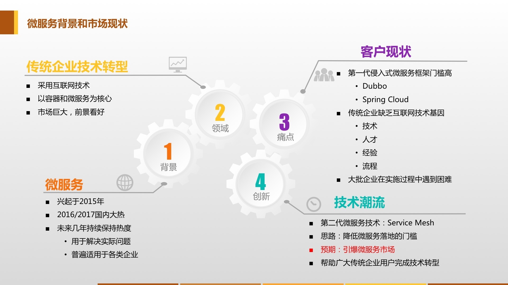

我们快速过一下。

目前微服务的背景是这样，首先目前在市场上是有这么一个潮流：传统企业会慢慢向互联网技术转型，其中微服务和容器是这个技术转型的核心。这个市场比较大，大家也都看好这样一个方向，这是大的时代背景。

简单回顾一下，微服务在国内，基本上是在2015年开始兴起。2016/2017这两年在国内的基本上就是大热了。我们能看到的是，未来这一两年之内，这个热潮应该继续延续。主要还是因为微服务这个技术是用于解决实际问题的，另外它也同样适用于各种企业。这样的大背景之下，我们来看现在使用微服务的客户现状。

实际上，我们之前在谈到Service Mesh技术为什么演进的时候，我们有提到，在Service Mesh之前，第一代的侵入式微服务框架，它的门槛相对稍微高一点，典型的代表的是Dubbo，Spring Cloud。对于传统企业来说，传统企业其实缺乏一些互联网的技术基因，这些包括技术，人才，经验，还有开发流程。在实际的市场当中，我们可以看到，大多数企业，虽然他们试图在微服务方面有一些转变，但实际上，在落地的时候还是会遇到一些问题。目前第二代的Service Mesh技术其实主要是冲着解决这个问题来的。他的思路在于要想办法用Service Mesh这样一个技术来降低微服务落地的门槛，最后帮助传统企业完成整个技术转型。这是目前大的背景和现状，我们下面来详细聊一下在这个背景当中一些具体的东西。

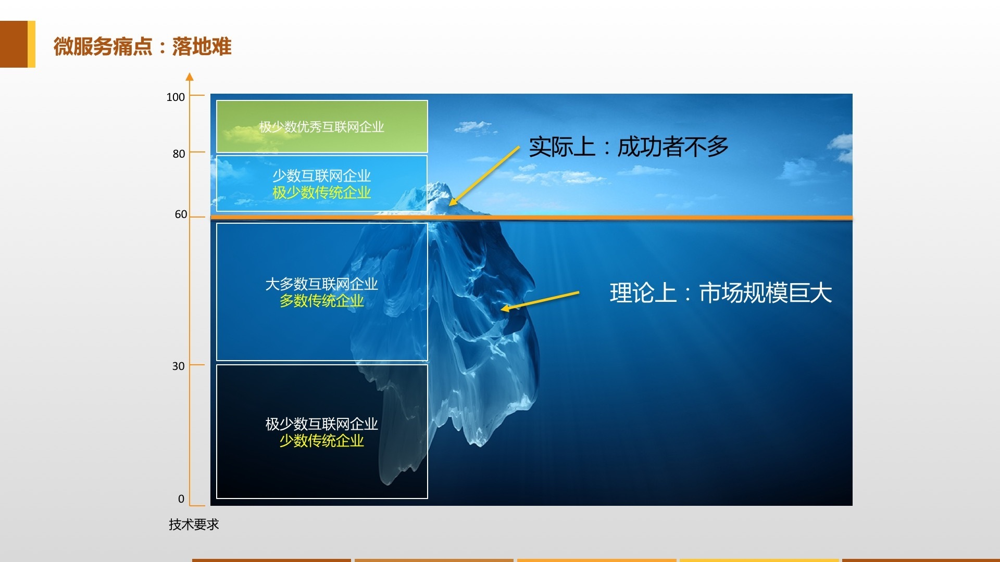

微服务的一个痛点：落地很难。

在这个地方我放了一个冰山图，左边的有一个坐标，就是说要实现好一个微服务，技术要求大概是一个什么样子，我这边简单的画了一下。

实际上我们可以看到，就是说如果以60分为及格线的话，那很遗憾的是，虽然这个冰山我们看它的体积非常的巨大，这个市场规模是非常大的，但实际上到目前真正能够落地的，能够浮在水面上的，其实并不多。这个问题在哪里？

**因为它落地太难了**。

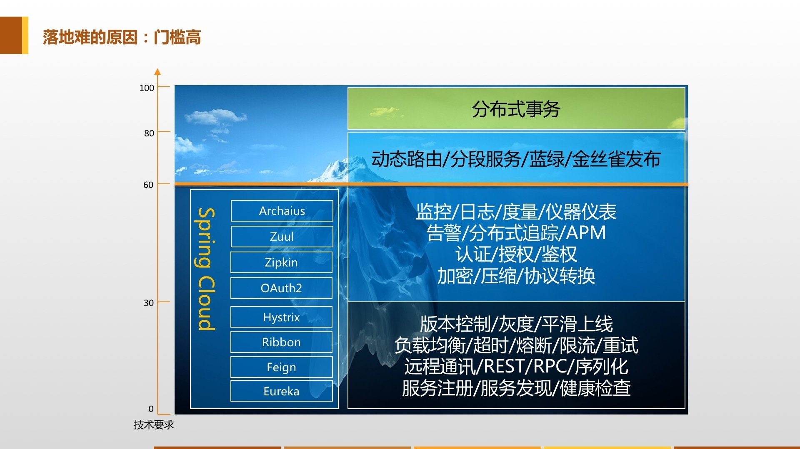

落地难的原因是门槛比较高。我们简单的罗列了一下，比如说典型的Spring Cloud，他的技术栈，我们看到的这些特性的列表。大家可以看到非常多的东西，左边这个地方Spring Cloud的各个组件。大家如果用过Spring Cloud的都会比较熟悉。当然两边并不是严格对称，这只是一个示意。

实际上在这样的一个巨大的特性列表和组件列表当中，比较头疼的是：如果你是一个新人的话，你要第一时间掌握的东西其实是非常多的。Hello Would都很简单，但是你真的要掌握，这些东西是要一个一个吃透的。

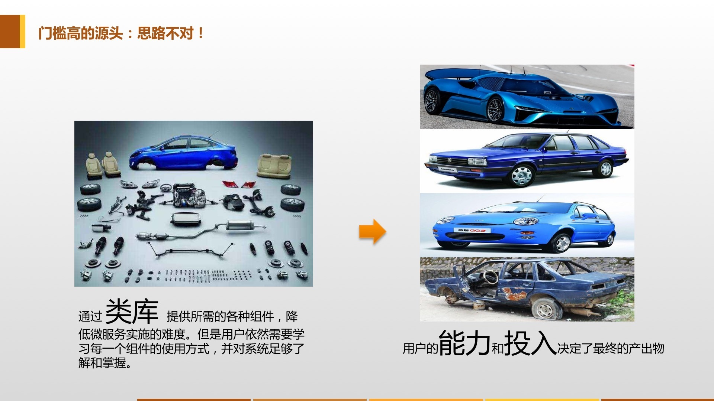

为什么这个门槛会这么高？在这里面要指出一点，就是说：解决问题的思路有点不太对。

我们先看左边这个图，我们现在如果是想要一辆汽车，那OK，可以像左边这个图一样。我们看到一辆汽车分解之后是会有多少个零件？我们现在通过类库的方式，实际去组装辆汽车，我可以给你不同的组件，不同的类库，然后告诉你这个是发动机，这个是轮胎，这个是刹车……这确实会比自己从头到尾，从每一个螺丝钉开始制造，去组装整车要轻松的多，比如说至少有个成熟的发动机，至少方向盘可以不用自己做了。但是实际上，对用户而言，必须要对整体有非常深的认识：你知道每个组件能做什么，选择合适的组件，并把他们并拢起来。这样对一个系统的了解是需要比较深的。

我们再看看右边：你组装出来的东西是什么样子？最上面这个跑车可能是所有人的梦想，对吧？但实际当中，不同的用户，他的能力是不一样的，他的投入也不一样。那他最终得到产出品，很有可能不是上面的这个让大家心动的跑车。很可能只是一个普通的大众，只能只一个QQ，甚至，其实最后一张图非常凄惨：不知道出来的会是什么，很可能是接近无法使用的产品。

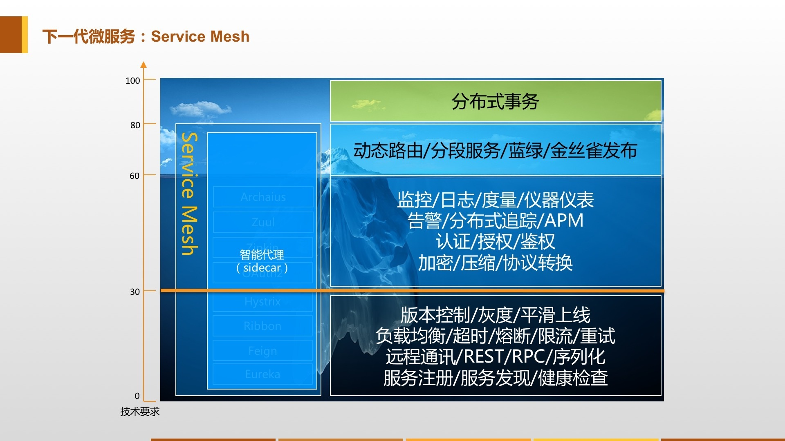

在下一代的Service Mesh当中，会用其他的方式来完成这个事情。

首先通过智能代理的方式，屏蔽掉大家对底层各个组件的认知。Service Mesh会通过直接使用Sidecar的方式来完成这些功能。

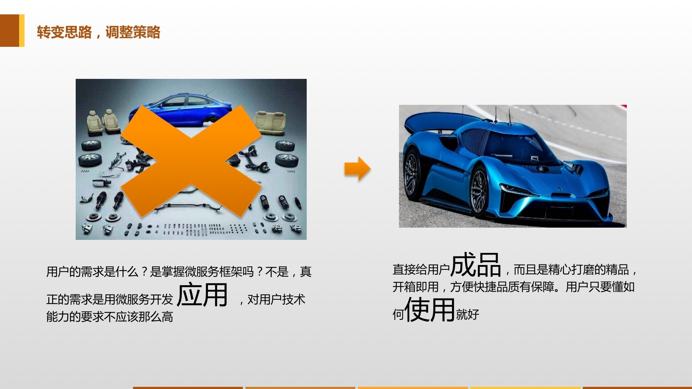

从思路上说，在这个时候，最大的事情是**调整战略**。

我们回到需求：客户用这些东西的需求是什么？它的目标是把这个车造出来，但造出这个车的下一步，是开着它上路，去该去的地方。造车，并不是他的最终的目标，对吧？我们回到现实的例子，大家学习Spring Cloud的目标是仅仅掌握Spring Cloud吗？我们说到，做微服务的实现，是把我们体系架构在微服务之上，然后让整个体系可以更快更好的运转。所以呢，客户真正的需求是用微服务做开发，做应用开发，应用是它的核心价值。这种情况下，对于微服务系统本身的掌握，要求其实不应该那么高。

比如说我随便举个例子，我相信在座的各位，很多同学开过车对吧？你可能开车的驾驶技术很高，但是如果我们现在，举个例子说：我给你一堆组件给你组，你能不能组装成一辆车？我相信在坐的同学应该没有几个能办得到。

所以，在这个地方，在Service Mesh里面，最重要的是：我们会做一个思路的转变。我们不再以组件的方式给客户提供服务，而且直接给客户成品，而且是精心打磨的成品。这个大家梦想中的跑车，开箱即用，直接呈现在客户面前。它非常的方便，可以非常快速地使用它。他的品质是经过打磨好之后的，然后客户只需要知道该怎么驾驶就好了。

这是整个Mesh的思路。

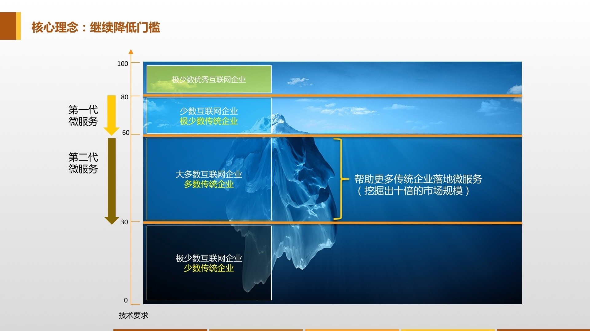

在这个思路背后，代表了一个重要的核心理念。我们会看到，第一代的微服务将当时微服务开发的门槛降低了，在第一代微服务之前，你需要一切从零开始，你需要从每一行代码开始。换句话说，在你造整车的时候，你需要从每个螺丝钉开始，这必然是很难的。

第一代微服务至少提供了一些成熟的组件，比如说发动机OK啦，这个门槛它降低了一部分。第二代微服务，我们是希望在这个基础上，将门槛进一步降低。60分不再是及格线，我们希望将它降成30分。这个目标如果能够达成，对于期望用微服务来做技术革新的企业来说，他这个时候可以更容易地落地。大家可以想象，一场考试，及格线是60分和及格线是30分，这个时候及格率会发生质的变化，这个时候能释放出来的市场规模也会远远大于前者。

OK，这个第一阶段我们讲好。

嗯，在这个地方，我想问大家一个问题：在座的各位，有没有哪一位所在的企业是真正的将微服务落地在一线生产上的？张亮兄？OK，你这个没问题。还有没有哪一位？OK？好，这个属于冰山水面上的部分。后面还有没有其他同学？有没有同学做过尝试的？就是在你们的实际的生产当中，实际落地微服务的架构，OK，这边有些同学。

好，实际上调查的和我们预期的还是有点像的。真正的大家能够把微服务落地的，就是冰山上面露出来的一小部分。

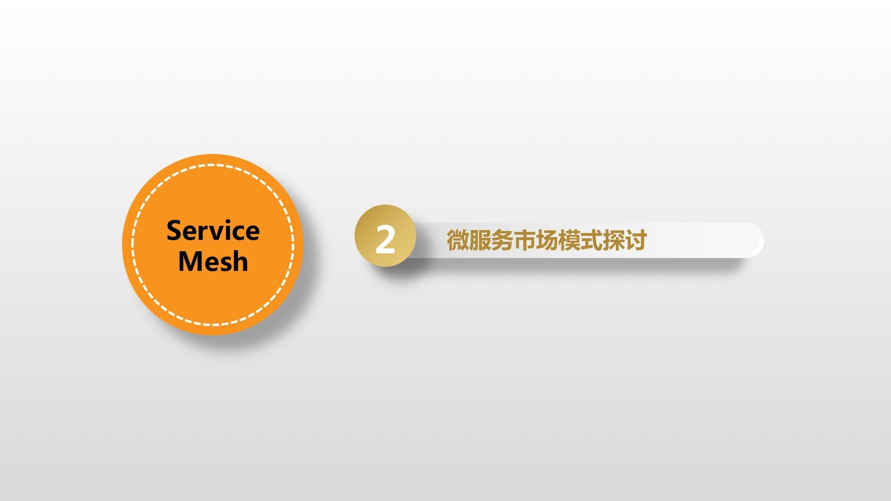

OK，我们进行第二个探讨：Service Mesh和微服务市场模式的探讨。

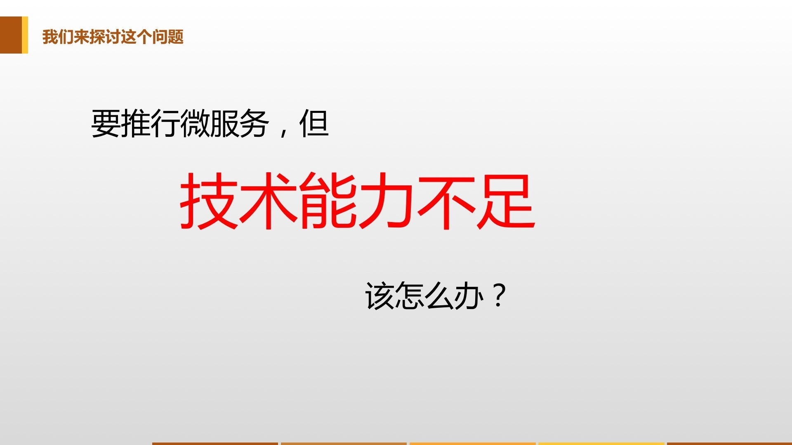

我先抛出一个问题：假设现在有一个公司，他要推微服务，但它确实之前没有这样的经验，它可能也缺乏这样的人才，所以在技术能力上它会有些欠缺。那这个时候怎么办？

哪位同学能给我想一个办法？或者说如果现在你的领导和你说：我们要上微服务了，有什么办法？这个很现实的，领导明天就你定方案，然后你发现你的团队好像大家都没玩过，也都不会。请你告诉我怎么办？有没有哪个同学给我一个想法？

> 注：现场互动，有同学回答说，需要领导重视。

嗯，非常重视，我们明天就上！

> 注：现场互动，有同学继续说，招人，外包。

恩，招人和外包，还有别的吗？OK，好，这位同学至少已经找到了明天早上开始推行微服务的一些方案了。

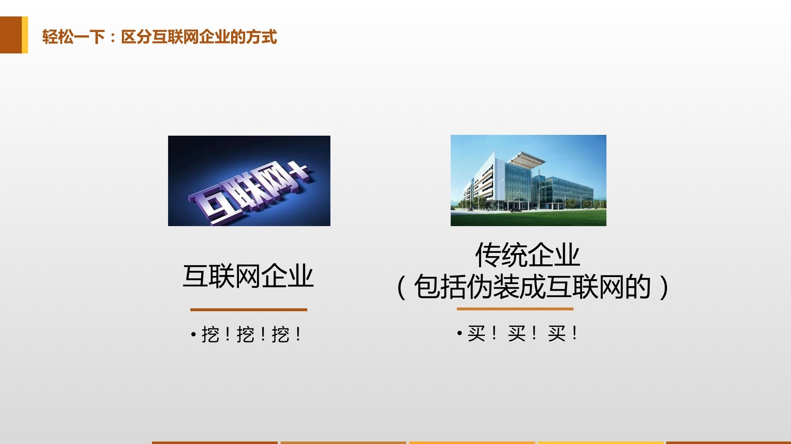

OK，我们简单过一下，刚才这个同学这里有一个比较有意思的地方：招人。这个有个比较有意思的东西给大家轻松一下。

这个是我个人的玩笑，用于区分互联网企业的一个简单方式：当发现有些事情自己不会做，也没有合适的人手，没能力的时候怎么办？一般互联网公司的习惯都是：挖！没人是吧，看一下业界谁会，挖！挖不过来是吧，薪水乘2？OK，互联网公司一般习惯这么干。但是传统企业一般不喜欢这么干，这里还包括伪装成互联网，大家应该懂这个意思吧？嗯，他的业务有可能是互联网业务，但他的工作方式，整个运作可能是传统企业的方式。但它的业务模式可能是互联网产品。这种企业的通常情况下它的习惯是买！拿钱去买，但他能买到什么？

当然这是个玩笑，但是有时候还是挺准确的，大家可以私底下去验证一下。

那我们现在说说，能买什么？

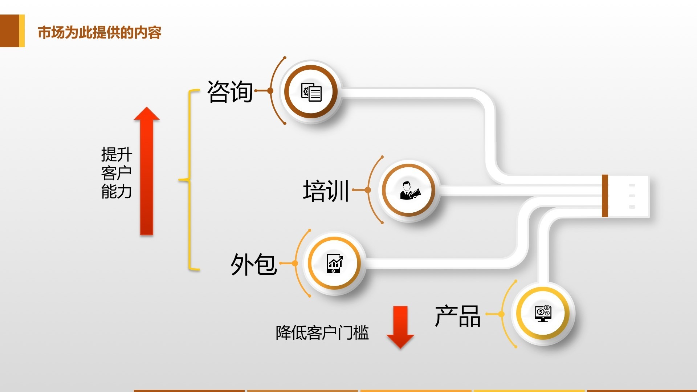

在这个市场，能为微服务的开发提供什么样的产品，什么样的服务吗？刚才同学说了一个：外包。是的，这个很正常。确实有非常之多的外包，但还有两个，一个是咨询，教你怎么做；一个是培训，包括出书也是一种培训，现场培训是另一种。还有一种就是卖产品，微服务相关的各种产品。整个市场会提供这些产品，但我们会注意到：前三者是不一样的。咨询、培训、外包本质上是要提升客户的能力，就是让你的能力更强。如果大家记得前面的那条线的话，现在就是在你考试的时候，让你的考试能力更强。产品是帮你稍微降低一下门槛。比如我告诉你，第五道题的答案是B，你填上就好了。最终达到大家及格的目标，至少起码及格。

整个市场提供的产品，大概是这个样子。

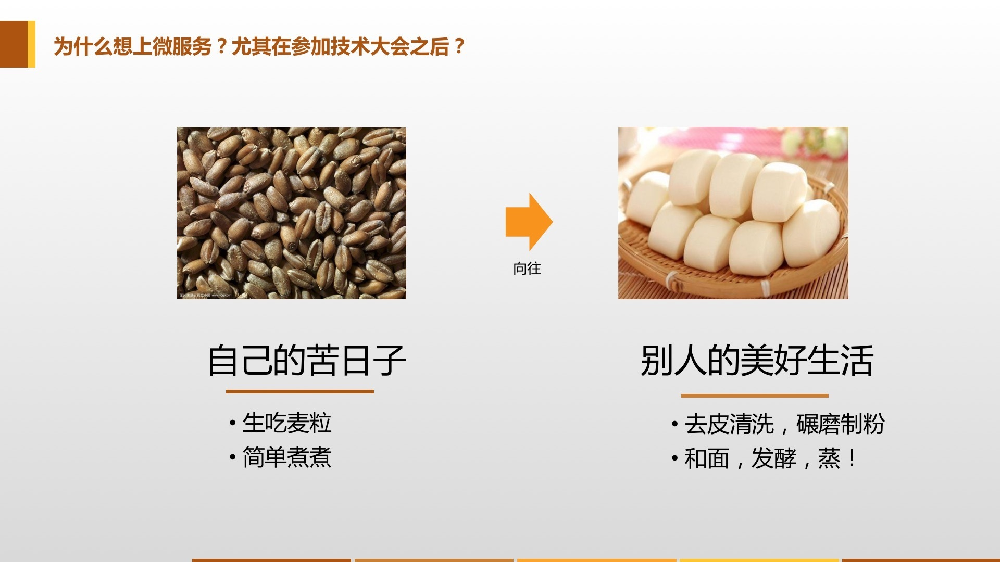

我们聊另外一个话题，可能更有意思：为什么大家想用微服务？尤其在参加技术大会之后。平时大家苦日子过习惯了，后来某人参加了某个技术大会之后，回来就觉得：平时这苦日子过得有点惨。旁边的这个是麦粒，不知道大家有没有吃过？晒干之后脱皮直接煮着可以吃的，甚至也可以生吃。然后是非常难吃的，很难下咽，但古代，我们的祖先原来就是这么吃下来的。后来发现参加了一场大会之后，发现这个受不了，为什么呢？发现别人吃的是右边的东西。

这个叫什么？不患贫而患不均，对吧？左边这个其实也不是过不下去，但是当你看到右边之后，通常一般人都受不了了。别人告诉你说要去皮，你要磨成粉，之后你要和面，发酵，蒸，然后就有这个吃了。大家一看，开完大会之后就发现，对啊，左边这个麦粒确实没必要这么吃，对不对？

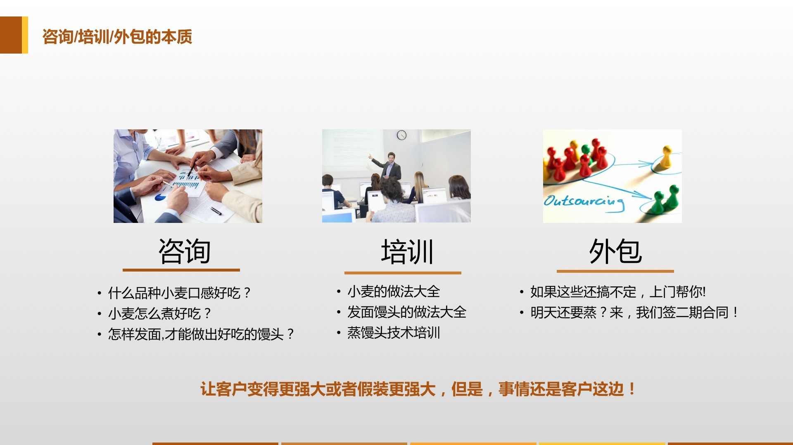

我们现在回到刚才的这个话题：咨询、培训、外包的本质是什么？

咨询是告诉你，看个例子，咨询告诉你什么品种的小麦口感好，或者说告诉你微服务12要素。嗯，然后告诉你，Spring Cloud是个不错的选择。

培训是什么？告诉你，这个小麦怎么种，这个馒头要怎么蒸，对吧？接下来告诉你，什么三个星期或者三天快速掌握Spring Cloud。

外包是什么？就是这些东西，做咨询了，给方案了，也做了一些培训了，但是还是搞不定。可能技术不够，也可能人力不足。那怎么办？上门帮你。对吧？我直接帮你蒸一屉馒头，客户就会问了：今天搞定了，明天怎么办，是吧？这个问题肯定是现成的，今年的这个目标搞定了，但是馒头明天还是想吃，不想明天再搞回去的，是吧？OK，好开心的告诉客户，二期合同，签二期合同，轻松帮你搞定。

那我们可以看到说：这三个本质是什么？是客户变得更强大，对吧？咨询、培训是让你变得更强大的；外包，让你变得假装更强大：其实没这个能力，但是在别人帮助的情况下，可以在短时间之内达到这个能力。

但是别忘了：整个事情还是在客户这边的，这个还是自己的事情，如果能力不够，明天的事情还是做不好。今天让别人帮忙蒸好了馒头，明天没人蒸的话，还是得回去啃麦粒。

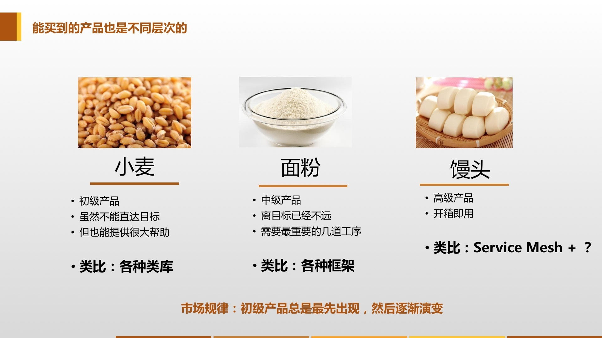

然后我们可以看到，买到的产品也是不同层次的。

我们做个简单的类比，初级产品是提供一些原材料，不能直接达到目标。但是不管如何，它会给你基石。至少在有小麦的情况下，还有机会煮一煮，对吧？类比各种类库，给一些基本的类库，至少还有机会不要从零开始。当肚子饿的时候，你说我没有吃的，我现在今天开始种地，对吧？等到半年之后，开始有收成，这不现实。所以，不管如何，初期产品至少让你有一个比较好的起点。

再往后，中级的产品，比如说面粉，这个时候离馒头已经不是很遥远了。但是你还是需要一些比较重要的工具，类比就是各种的框架。基本上有面粉之后，起码不会饿死对吧？不管做的有多难吃。但是呢，有多好吃就是另外一回事，后面还有很多工序需要自己去完成。

相比之下，大部分同学可能还会选择：这个自己做的不太好，我们还是选最高级，开箱即用。直接下单，那边马上给你端上一笼馒头，马上就搞定。这肯定是比前面自己种地或者买面粉要快的多，类比的话就是Service Mesh。在这里我加了一个问号，后面大家会了解这个问号是什么。

实际上，在市场上能买到的产品，是不同层次的。市场的规律通常是这样，在满足需求的前提之下，最初期的产品都会在第一时间出现，然后逐渐的开始演变，开始向高级产品来演变。对于微服务市场来说，现在的高级产品就是Service Mesh。

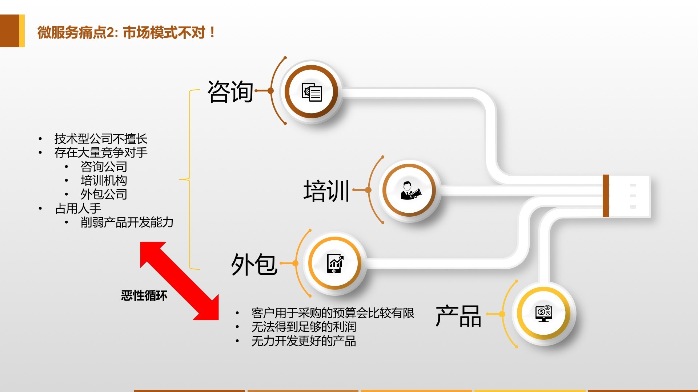

我们回到第二个痛点。前面我们说微服务落地的重点在哪里，第一个是门槛，微服务的门槛高实在是有点高。这里我们看第二个痛点：微服务的市场模式是不太对的。

我们现在细细看，就是说，咨询、培训、外包，对于市场来说，有能力提供微服务相关服务的这些公司，大多数是技术型的公司。不管是创业公司，还是大一点像阿里腾讯这种比较大的。这些公司有个问题：它其实不是太擅长咨询培训外包的，毕竟这个不是它的主业。同样在这几个领域当中，市场存在大量的竞争对手，比如咨询公司，大家熟悉的，培训公司，还有各种外包。这些对于做技术型的公司来说通常不擅长，而且即使他可以来做，也会占用大量的人手。一旦占用人手的话，就没有能力去开发产品。

我们看第四个，会发现：这个产品麻烦了。客户的资金，他的预算，一般来说是有固定的。当他的预算大部分投入到咨询、培训和外包之后，还有多少钱来买产品？他不买产品，技术公司就没有办法得到利润，没有利润，就没有足够的财力去开发更好的产品。

没有更好的产品，就不能靠产品解决问题。

那客户就要回答说：产品不能解决我的问题，我就继续回到咨询、培训、外包的这个主流上来。这个地方形成一个很要命的恶性循坏。

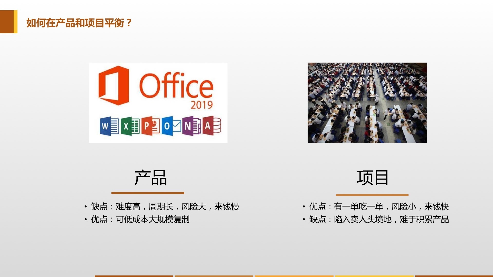

在我之前的经历当中，我是在这个市场的乙方公司做过事情。我们当时其实是面临一个比较难受的事情，就是说：如何在产品和项目之间平衡。我相信这对于所有在微服务市场提供服务的乙方公司来说，都是一个非常非常现实的话题。

产品是个什么概念？大家最熟悉的，左边这个图，office系列，或者说它背后的windows操作系统。差不多是过去十几年，软件行业我感觉应该是最成功的所谓”产品”。产品的概念：难度非常大。你看windows、office出了这么多年，有谁超过了？然后它的周期非常长，开发一个产品，好几年。几千个人，甚至更多的人堆在上面。它的风险非常大，一次投资就是几亿几十亿。然后来钱其实挺慢的，因为他要慢慢铺开。这个产品铺上去可能几年之后陆陆续续回本。但是，有个极大的优点：非常低成本的大规模复制。Office 2019，它的第一份拷贝成本可能高到几十亿美元，但它的第二份拷贝的成本是多少？第两千份拷贝的成本是多少？第1000万份，它的成本又是多少？

所以我们就发现针对于技术公司而言，对于大部分技术公司而言，其实最理想的是做产品，对吧？产品做好了，然后再卖给更多的客户。

但是很多时候，事情往往没这么简单。很多时候我们遇到一个事情：会有一个“项目”的概念。有个客户，他有一大堆的东西，这些东西无法形成一个通用的需求，也没办法由简单的产品去覆盖它。然后可能就会用咨询、培训加外包的方式帮他搞定。OK，好处是说有一单是一单，客户的需求是摆在面前的，风险很小，基本上技术上肯定可以搞定，半年一年之后就能把这个项目的钱结回来。但是它的缺点是：陷入卖人头的境地。因为项目的可重复性是比较差的，当你接到第二个项目的时候，你会发现它其实需要重头来过，很难把两个项目之间的东西去积累成产品。

我相信在座的如果有做乙方的，包括做内部乙方的，给其他人提供服务、产品来解决问题时，应该都会遇到这两个问题。这个平衡是相当麻烦。

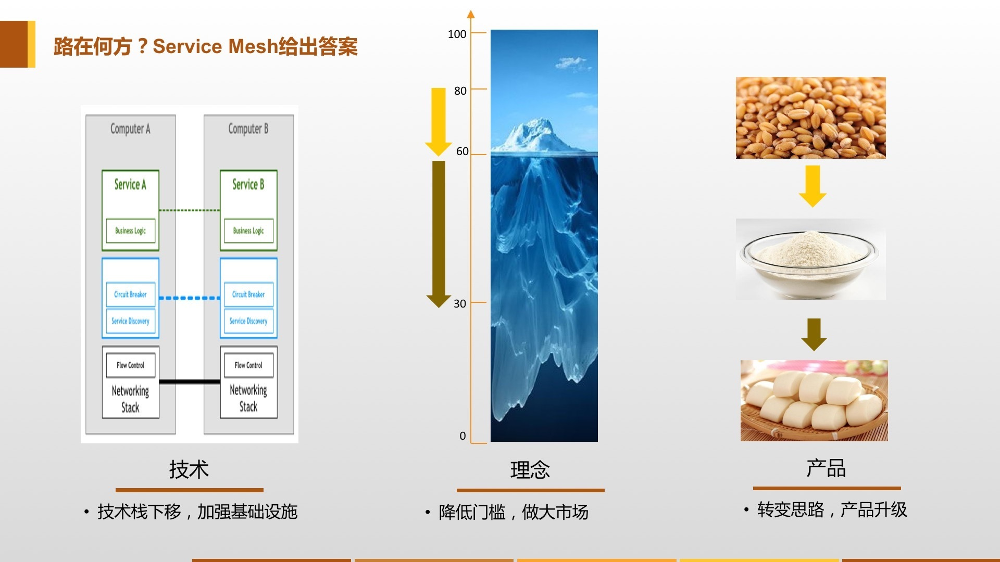

路在哪里？Service Mesh给出几个答案。

左边这个是在之前曾经做过的分享，从技术上来说，因为我们今天没讲技术，所以没有提过。从技术上说，Service Mesh提供了一个方案，就是说将整个服务间通讯的解决方式，整个技术栈全部下移。从应用当中下移到底层的基础设施，通过加强基础设施的方式提供一个统一的解决方案，这是从技术的角度。

在前面我们提到，从理念的角度上说，Service Mesh是希望将微服务市场的门槛降低，然后形成整个市场的规模增大。

我们在前面也提供了一个产品的思路：解决问题的思路要发生变化。要实现产品的升级，不能卖初级产品，要想办法提供最终的成型的成熟的产品。

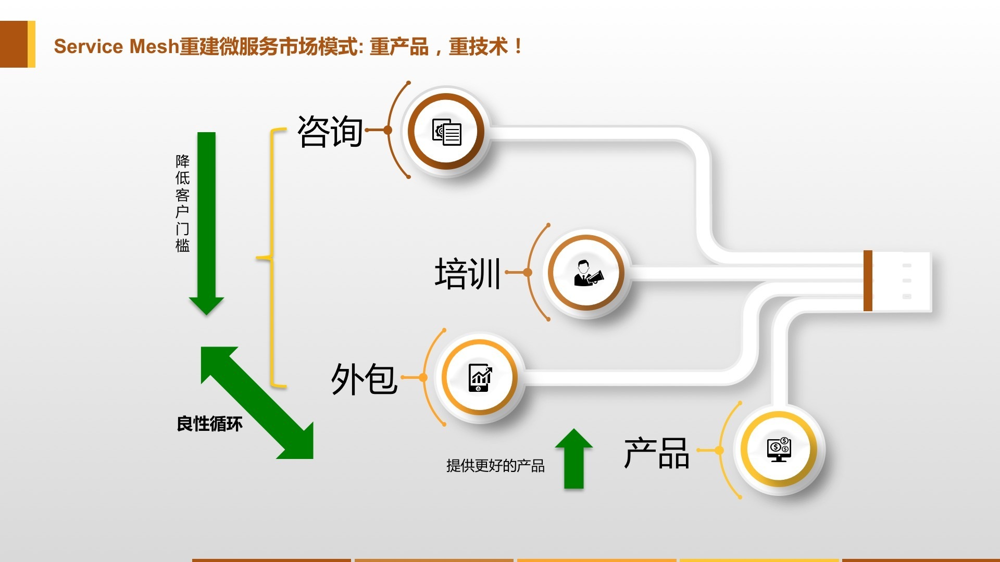

OK，这是Service Mesh在这个时候非常重要的一件事情，就是：可以重建微服务市场的市场模式。

将整个模式牵回到一个正统的**重产品重技术**的途径，也就是说，我们会通过提供更好的产品，然后这个产品可以更多的更普遍地满足客户的需求，从而降低客户的门槛。当客户入门的门槛降低的时候，他对于咨询、培训、外包的需求就会降低。那他会有更多的资金预算投到产品的采购当中，这样会让提供产品的技术公司有更多的利润，然后继续加强产品，形成这样一个良性的循环。这是Service Mesh在整个微服务市场当中非常非常重要的一环，必须要让原来的恶性循环的场景开始向现在这样一个良性循环做转变。

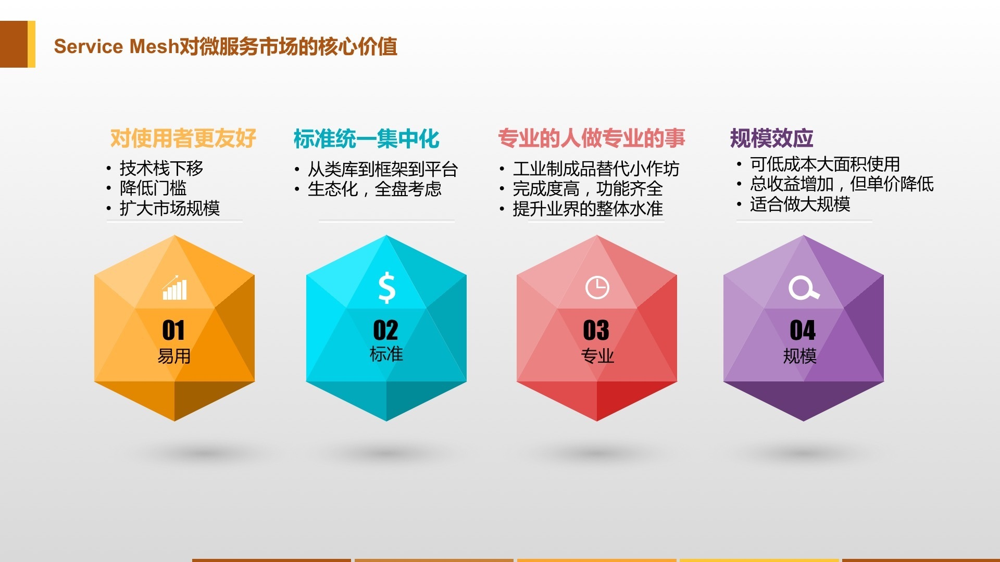

我们来详细的过一下，Service Mesh对于微服务市场的核心价值，主要是四块：

第一是对使用者更加的友好，体现在技术栈下移，降低了整个微服务入门的门槛。最终达到扩大市场规模的目标，这主要是体现它的易用性上。

然后，第二个核心价值体现在标准。从类库，到框架，再到平台，整个生态是越来越大的。

而一旦到了Service Mesh这个领域，就不会拘泥于细节，而是通盘考虑，考虑生态如何做。整个体系，所有组件，这些组件之间的交互是什么？这有个好处，它会自然而然的去统一，去集中化这些模块，然后在上面再制定一个标准。

第三个价值在于Service Mesh提供专业化的解决方案。大家常说的，“专业的人做专业的事情”。在这个领域，微服务之间的通讯，这是一个专业度非常高的领域，这个领域应该出现工业级成熟度的制成品。而不应该让每一家公司都以小作坊的方式去各自完成。我们期待的是一个工业级的产品，它应该有非常非常高的完成度，功能齐全，以此来提升业界的整体水准。随便举个例子，今天大家能拿到的任何一个哪怕微不足道的小螺丝钉。你就想想，如果用人工的方式去做，他们开发成本会有多大？工业制成品的概念就是在这个地方，通过大量的标准化，通过工业制造，可以做到非常好的精度，同时成本降到极低。

这在整个市场上体现为规模效应。为什么？如果一天的时间只做一个螺丝，这个成本非常的高，如果开一台机器，一天制造了100万个螺丝，成本在哪里？所以，在这个点上有个非常重要的事情，就是：一定要可以低成本的大面积的使用。

如果你的螺丝不标准，你在某个地方一定要需要一个特殊的螺丝，这个螺丝的规格跟其他都不相同，一定要手工制作。那这种情况下，你是没有办法去降低成本。你只有通过前面的易用性，标准，专业来实现。这些事情最终的目标，都是让这个产品最终实现可以低成本的大面积使用。这个时候可以做到一个事情，就是说你最终总的利润可以增加，但是你的单价是降低的。

Service Mesh这样的一个技术，对于市场有一个比较好的事情，是说它适合**把规模做大**。

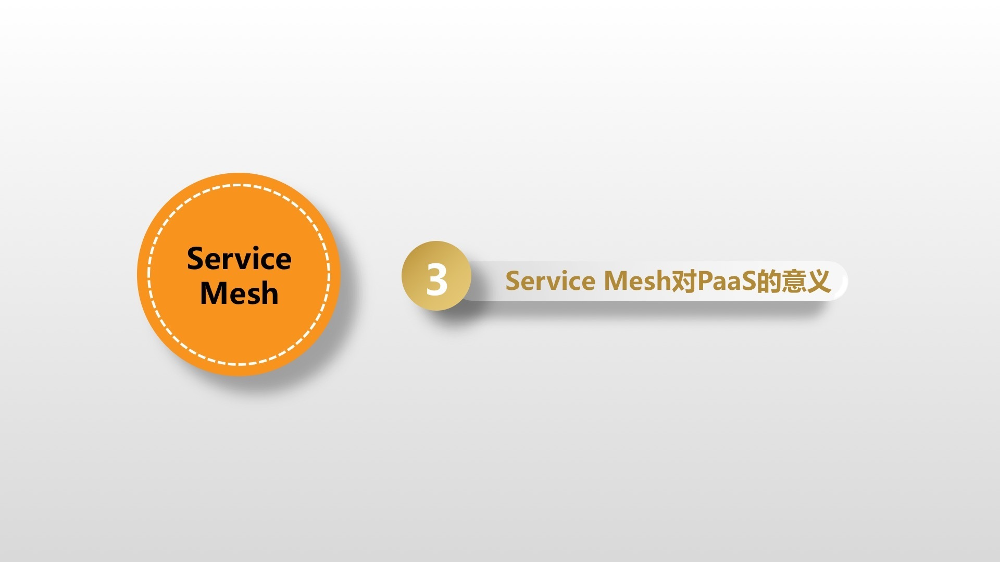

OK，我们探讨了service mesh对微服务市场模式的重新塑造。我们现在进入第三段，Service Mesh对于PaaS平台的价值和意义。

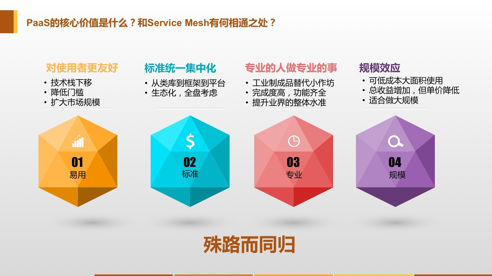

在开始这个话题之前，我们先简单过一下，PaaS的核心价值是什么？它跟Service Mesh又有什么相通的地方？大家记得前面列了四个东西，第一个是易用，对使用者友好，大家会发现PaaS提供的价值也是如此，PaaS也是让大家可以更轻易的更简单的实现整个平台。标准，这个不用说了。专业，大家会发现，其实现在PaaS平台会慢慢的向少数的解决方案集中。基本上已经很少有小公司自己再去做一个自己的PaaS平台了。大规模，大家都有联系到，目前PaaS市场上比较大的一些公有云，会发现这个规模其实是非常可怕。

大部分公有云，如果体积规模发展比较迅速的话，每年乘2是很正常的。我们发现PaaS其实和我们之前谈到的Service Mesh，几乎是一脉相承。为什么？殊路而同归。

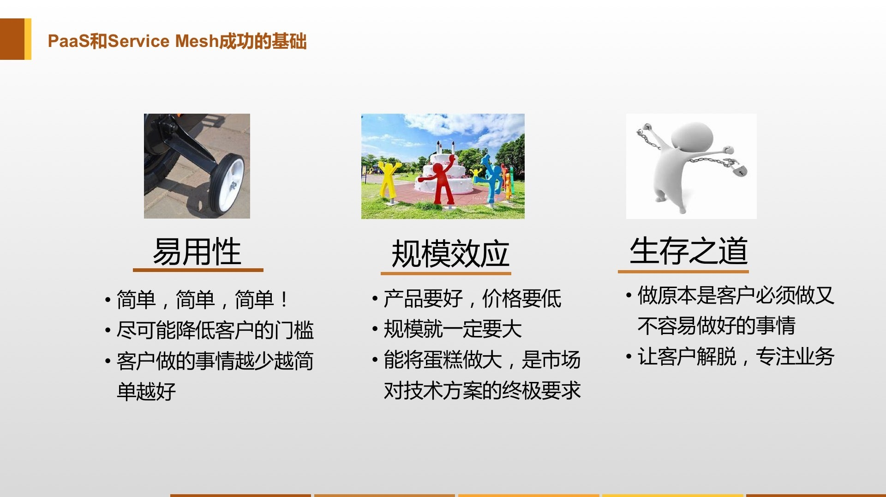

PaaS和Service Mesh成功的基础，其实就是在这几个关键的点上。

一个是一定要简单易用。这个轮子大家有没有印象，有小朋友的就会知道，这个是自行车后轮的平衡轮。有这个平衡轮之后，没有任何基础的小朋友也可以骑上自行车了，就叫易用性：非常非常简单，让你的入门门槛瞬间降低，客户做的事情及其简单。

第二个事情是一定要有规模效应，产品要好，价格要低，怎么做到？只能把规模做大。要把规模做大，还有一个事情，就是一定要想办法把蛋糕做大。因为就算你把市场百分百占了，如果这个市场本身不大，那这种情况下其实就算占了百分百，也就一小块。所以接下来一个事情就是一定要去把这个蛋糕做大。

整个PaaS和Service Mesh的生存之道（大家如果有留意到，我们一路下来这个脉络）是说它做了一个重要的事情，就是它实际上是在帮客户做事情：这些事情是客户必须要做的，但是他又不太容易做好。我们的生存之道是帮助客户从这些细节里面解脱出来。客户大多数情况下是业务驱动的，我们要做的就是把所有的他要做又不好做的这些事情都下沉下来，我们帮他做好。

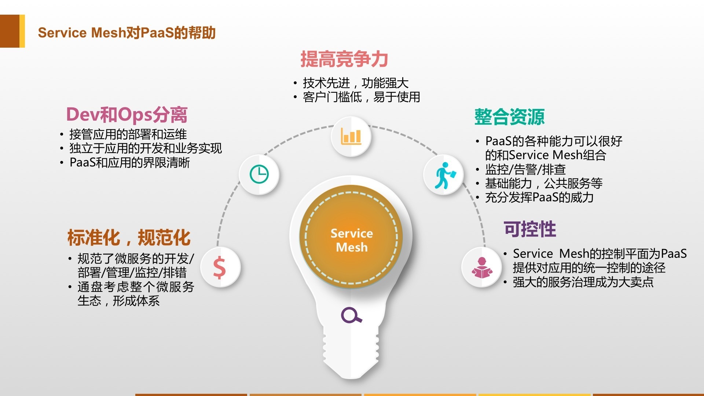

Service Mesh和PaaS在理念上是相通的，Service Mesh对PaaS的价值体现在下面的几个方面：

第一个是标准化和规模化，那这个我们讲的挺多。

第二个，会涉及到跟技术相关的一些内容，它可以让开发和运维分离。Service Mesh会接管整个应用的部署、运维和对应用的管理，它独立于应用的开发和业务实现。这样的好处是可以将大家熟悉的一些比如说服务治理的各种功能，让它独立应用的开发之外，而这些功能通过Service Mesh来实现。当Service Mesh变成PaaS的一部分之后，PaaS和业务之间的这个界限会变得特别的清晰。应用集中在业务语义，而剩下的所有的部署、运维、管理、监控通通放在PaaS，这样两者之间的界限清晰。

另外一个就是提高竞争力，因为Service Mesh代表着技术先进性，提供了一些非常强大的功能，同时它会降低客户的门槛和客户易于使用，这个对于客户而言吸引力是非常高的。

然后可以帮助PaaS平台更好的去整合资源，因为PaaS天生是提供各种能力的。这些能力，原来是以单个单个的方式提供给客户，大家如果有注意到的话，所有PaaS平台都卖各种产品各种能力，然后可以自己选择去用。Mesh有个好处是说它本身就可以天然地把这些能力组合起来，变成一个统一的全套方案，直接覆盖监控、告警、故障排查，变成整个基础能力的一部分，变成PaaS平台的一部分，通过这样的方式来发挥PaaS平台的威力。

另外就是引入了可控性。因为Service Mesh的控制平面，是可以对整个服务间通讯、对服务治理做到集中式的管理。这些控制的能力，如果为PaaS所用，那PaaS就会平添一种能力，去对整个应用做统一的控制。在此之前PaaS平台对应用的控制更多是集中在非常粗的层面，比如说启动、关闭，但是内部其实没办法干预。可以给它分配资源，但是你实际上没有办法去管控，比如说一些服务治理的功能。那通过整合Service Mesh之后，PaaS就开始有能力对服务进行管控，而且这个能力会变得非常强大。而强大的服务治理功能，会变成PaaS平台的重要的卖点。

这是整个Service Mesh对于PaaS的帮助。

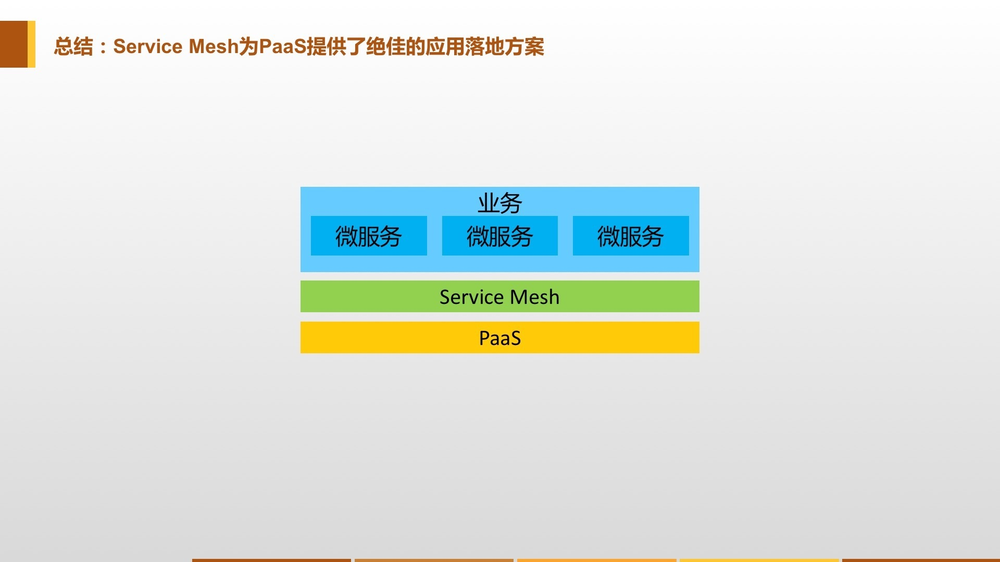

我们简单总结一下：Service Mesh技术为PaaS平台提供了一个非常好的应用落地方案。

底层是PaaS，PaaS如果直接接业务的话，通常是比较累的。客户选择用微服务之后，就会选择Spring Cloud之类的东西，还是要自己做一层比较厚的框架层。有Service Mesh技术之后PaaS会更好的对接微服务，对接业务。

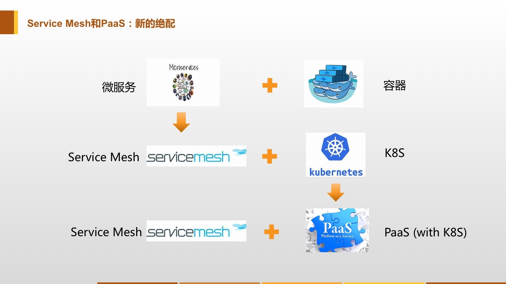

最后我们会提到，Service Mesh和PaaS，我们称之为**绝配**。所谓绝配，是说这样一个搭档相互之间是非常的舒服：让彼此的能力互补，然后增强对方的优点。

在最早的微服务时代，微服务和容器被认为是一对绝配。应该说这两个技术的互补性是非常强的。微服务已经进展到Service Mesh阶段了，而容器经过市场淘汰已经开始向K8S靠拢了。接下来，在这样一个基础上如果能再走一步，当k8s逐步向PaaS平台靠拢，也就说PaaS实际上是一个基于K8S的PaaS。那它和Service Mesh之间的搭档会成为一个新的市场主流，成为一个更好的客户基础。当然现在还没有实现，目前市场上暂时还没有这样的产品，但我相信在未来一两年中这会成为市场的主流。

OK，我们今天的内容到这里结束，非常感谢大家，谢谢。
