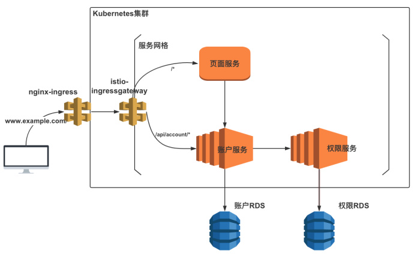
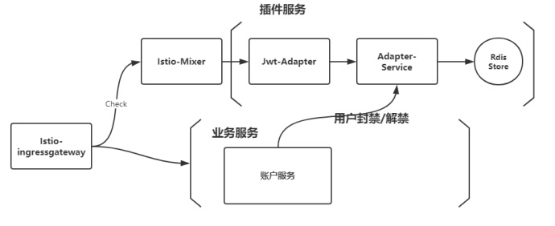

互联网服务离不开用户认证。JSON Web Token(后简称JWT)是一个轻巧，分布式的用户授权鉴权规范。和过去的session数据持久化的方案相比，JWT有着分布式鉴权的特点，避免了session用户认证时单点失败引起所有服务都无法正常使用的窘境，从而在微服务架构设计下越来越受欢迎。然而JWT单点授权，分布鉴权的特点也给我们带来了一个问题，即服务端无法主动回收或者BAN出相应的Token，使得即使某个服务主动封禁了一个用户时，这个用户同样可以使用之前的JWT来从其他服务获取资源。本文我们将阐述利用Istio Mixer Adapter的能力，来将所有请求在服务网格的入口边缘层进行JWT检查的例子，从而实现用户封禁与主动逐出JWT等功能。

## 背景

在我之前的[投稿](http://www.servicemesher.com/blog/practice-for-coohom-using-istio-in-production/)中，描绘了一个非常简单的基于K8S平台的业务场景，在这里我们将会基于这个场景来进行讨论。
对于一个简单的微服务场景，我们有着三个服务在Istio服务网格中管理。同时集群外的请求将会通过nginx-ingress转发给istio-ingressgateway以后，通过Istio VirtualService的HTTPRoute的能力转发给对应的服务，这里不再赘述。

从下图的架构模式中，我们可以看到所有的请求在进入网格时，都会通过istio-ingressgateway这个边缘节点，从而涌现出了一个非常显而易见的想法，即如果我们在所有的请求进入服务网格边缘时，进行特定的检查与策略，那么我们就能将某些不符合某种规则的请求拒绝的网格之外，比如那些携带被主动封禁JWT的HTTP请求。



## 了解Istio Mixer

为了达到我们上述的目的，我们首先需要了解一下[Istio Mixer](https://istio.io/docs/concepts/policies-and-telemetry/)这个网格控制层的组件。
Istio Mixer 提供了一个适配器模型，它允许我们通过为Mixer创建用于外部基础设施后端接口的处理器来开发适配器。Mixer还提供了一组模版,每个模板都为适配器提供了不同的元数据集。在我们的场景下，我们将使用[Auhtorization](https://istio.io/docs/reference/config/policy-and-telemetry/templates/authorization/)模板来获取我们每个请求中的元数据，然后通过Mixer check的模式来将在HTTP请求通过istio-ingressgateway进入服务网格前，通过Mixer Adapter来进行检查。

在Istio Mixer的[描述](https://istio.io/docs/concepts/policies-and-telemetry/#reliability-and-latency)中，我们可以发现每个请求在到达数据层时，都会向Mixer做一次check操作，而当请求结束后则会向Mixer做一次report操作。在我们的场景中，我们将会在请求到达istio-ingressgateway时检查这个请求中的JWT鉴权，通过JWT的Payload中的信息来决定是否要将请求放行进入网格内部。

得益于Mixer强大的扩展能力，我们将通过经典的Handler-Instances-Rule适配模型来一步步展开，同时也意味着我们将要编写一个自定义的Istio Mixer Adapter。

## Mixer适配模型

那么怎么通俗易懂的理解Handler-Instances-Rule这三者的关系呢？在我的理解下，当每个请求在服务网格的数据层中游走时，都会在开始与结束时带上各种元信息向Mixer组件通信。而Mixer组件则会根据Rule来将**特定的请求**中的**特定的数据**交给**特定的处理器**去检查或者是记录。那么对于**特定的请求**，则是通过Rule去决定；对于**特定的数据**，则是通过Instances去决定；对于**特定的处理器**，则是通过Handler去决定。最终Rule还把自己与Instances和Handler绑定在一起，从而让Mixer理解了将哪些请求用哪些数据做哪些处理。
在这里我们可以通过[Istio Policies Task](https://istio.io/docs/tasks/policy-enforcement/)中的[黑白名单机制](https://istio.io/docs/tasks/policy-enforcement/denial-and-list/)来理解一下这个模型。

在这里**appversion.listentry**作为Instances，通过将**list entry**作为模版，获取了每个请求中的source.labels["version"]的值，即**特定的数据**。**whitelist.listchecker**作为handler，则是告诉了背后的处理器作为白名单模式只通过数据是v1与v2的请求，即**特定的处理器**。最后**checkversion.rule**作为rule，将**appversion.listentry**和**whitelist.listchecker**两者绑定在一起，并通过match字段指明哪些请求会经过这些处理流程，即**特定的请求**。

```yaml
## instances
apiVersion: config.istio.io/v1alpha2
kind: listentry
metadata:
  name: appversion
spec:
  value: source.labels["version"]
---
## handler
apiVersion: config.istio.io/v1alpha2
kind: listchecker
metadata:
  name: whitelist
spec:
  # providerUrl: ordinarily black and white lists are maintained
  # externally and fetched asynchronously using the providerUrl.
  overrides: ["v1", "v2"]  # overrides provide a static list
  blacklist: false
---
## rule
apiVersion: config.istio.io/v1alpha2
kind: rule
metadata:
  name: checkversion
spec:
  match: destination.labels["app"] == "ratings"
  actions:
  - handler: whitelist.listchecker
    instances:
    - appversion.listentry
```

## JWT Check 的架构设计

当我们理解了以上的Mixer扩展模型以后，那么对于我们在文章开头中的JWT封禁需求的Handler-Instances-Rule的模型就非常显而易见了。在我们的场景下，我们需要将所有带有JWT并且从istio-ingressgateway准备进入网格边缘的请求作为我们**特定的请求**，然后从每个请求中，我们都要获取request.Header["Authorization"]这个值来作为我们**特定的数据**，最后我们通过**特定的处理器**来解析这个数据，并在处理器中通过自定义的策略来决定这个请求是否通过。

当我们搞清楚了这么一个模型以后，那么之后的问题就一下子迎刃而解了。在我们的设计中，我们将要自定义一个JWTAdapter服务来作为**特定的处理器**，JWTAdapter将会通过HTTP通信把数据转交给Adapter-Service来让Adapter-Service来判断这个请求是否合法，而Adapter-Service的凭证则是通过与业务服务的通信所决定。

在我们的场景中，假设每个请求所携带的JWT的Payload中有一个email属性来作为用户的唯一标识，当业务领域中的账户服务决定封禁某个用户时，他将会通知Adapter-Service，后者将会把这个信息存于某个数据持久服务中，比如Redis服务。当JWT-Adapter服务向Adapter-Service服务询问这个请求是否合法时，Adapter-Service将会通过Payload中Email属性在Redis中查询，如果查询到对应的数据，则代表这个用户被封禁，即这个请求不予通过，反之亦然。



## 如何自定义编写一个Adapter？

说实话，自定义编写Adapter是一个上手门槛较为陡峭的一件事情。我在这里因为篇幅原因不能完全一步步细说自定义Adapter的步骤。在这里我推荐对自定义编写Adapter有兴趣的人可以根据官网的[自定义Mixer Adapter开发指南](https://github.com/istio/istio/wiki/Mixer-Out-Of-Process-Adapter-Dev-Guide)和[自定义Mixer Adapter详细步骤](https://github.com/istio/istio/wiki/Mixer-Out-Of-Process-Adapter-Walkthrough)来进行学习和尝试。在这里我给出在我的JWT-Adapter中的关键函数来进行描述。

```go
func (s *JwtAdapter) HandleAuthorization(ctx context.Context, r *authorization.HandleAuthorizationRequest) (*v1beta1.CheckResult, error) {
  
  log.Infof("received request %v\n", *r)
  
	props := decodeValueMap(r.Instance.Subject.Properties)
	var Authorization interface{}
	if len(props["custom_token_auth"].(string)) > 0 {
		Authorization = props["custom_token_auth"]
	} else {
    // 没有获取到JWT,直接将请求放行
		return &v1beta1.CheckResult{
			Status: status.OK,
		}, nil
	}
	cookie := props["custom_request_cookie"]
	host := props["custom_request_host"]
	if host == "www.example.com" {
		url := userService + "/check"
		request, err := http.NewRequest("GET", url, nil)
		if err != nil {
      //出现异常时，直接将请求放行
			return &v1beta1.CheckResult{
				Status: status.OK,
			}, nil
		}
		request.Header.Add("Content-Type", "application/json; charset=utf-8")
		request.Header.Add("cookie", cookie.(string))
    request.Header.Add("Authorization", Authorization.(string))
    // 发送请求给Adapter-Service
		response, _ := client.Do(request)
		if response != nil && response.StatusCode == http.StatusOK {
			body, err := ioutil.ReadAll(response.Body)
			if err != nil { //如果有异常
        log.Infof(err) //记录异常即刻
			} else {
        log.Infof("success to get response from adapter-service")
				var value map[string]interface{}
				json.Unmarshal(body, &value)
				if value["pass"] == false {
					//当用户确实返回处于封禁状态中时，才返回封禁结果
					return &v1beta1.CheckResult{
						Status: status.WithPermissionDenied("Banned"),
					}, nil
				}
			}
		}
	}
	log.Infof("jwtadapter don't have enough reason to reject this request")
	return &v1beta1.CheckResult{
		Status: status.OK,
	}, nil

}

```

通过以上描述可以发现的是，在我们的场景下，我们当且仅当从Adapter-Service中确实得到了不允许通过的结果才将这个请求进行拒绝处理，而对其他情况一律进行了放行处理，即使发生了某些错误与异常。由于我们的错误处理会直接影响到这些请求能否在网格中通行，所在做Istio Mixer Check时需要时刻记住的到底是放行特定的请求，还是拒绝特定的请求，在这一点处理上需要十分谨慎与小心。

## Handler-Instances-Rule

当我们将自己的Adapter上线以后，我们只要通过声明我们得的Mixer扩展模型让Mixer识别这个Adapter并且正确处理我们想要的请求即可。这里我们再回顾一下我们之前所提到的**特定的请求**，**特定的数据**，**特定的处理器**。
对于特定的请求，我们需要将网格边缘的请求筛选出来，所以我们可以通过host是www.example.com并且携带了JWT作为条件将请求筛选出来。对于特定的数据，我们选用authorization作为模版，取出header中的JWT数据，最后通过**特定的处理器**，将这个check请求交给jwt-adapter。至此，我们通过Istio Mixer Aadapter来进行JWT封禁的需求场景算是基本完成了。

```yaml
# handler adapter
apiVersion: "config.istio.io/v1alpha2"
kind: handler
metadata:
 name: h1
 namespace: istio-system
spec:
 adapter: jwtadapter
 connection:
   address: "[::]:44225"
---
## instances
apiVersion: "config.istio.io/v1alpha2"
kind: instance
metadata:
 name: icheck
 namespace: istio-system
spec:
 template: authorization
 params:
   subject:
     properties:
       custom_token_auth:  request.headers["Authorization"]
---
# rule to dispatch to handler h1
apiVersion: "config.istio.io/v1alpha2"
kind: rule
metadata:
 name: r1
 namespace: istio-system
spec:
 match: ( match(request.headers["Authorization"],"Bearer*") == true ) && ( match(request.host,"*.com") == true )
 actions:
 - handler: h1.istio-system
   instances:
   - icheck
---
```

## 扩展阅读

### 网格边缘层验证JWT的可行性？

既然在网格边缘层能对JWT进行检查，那么能否可以做成在网格边缘层同时也进行JWT的验证？

答： 在我最初做Mixer Check时确实想到过这件事情，并且无独有偶，在[PlanGrid在Istio中的用户鉴权实践](https://medium.com/plangrid-technology/custom-user-authentication-in-istio-67c90458b093)这篇文章中，PlanGrid通过EnvoyFilter实现了在网格边缘层进行JWT以及其他鉴权协议的鉴权。但对此我的看法是，对于JWT鉴权的场景，我并不推荐这么做。因为微服务场景中，我们使用JWT的初衷就是为了分布式鉴权来分散某个服务的单点故障所带来的鉴权层的风险。当我们将用户鉴权再一次集中在网格边缘时，我们等于再一次将风险集中在了网格边缘这个单点。一旦istio-ingressgateway挂了，那么背后所有暴露的API服务将毫无防备，所以鉴权必须放在每个微服务内。另一方面，在我的[《深入浅出istio》读后感](https://yisaer.github.io/2019/02/01/read-istio/)中提到，对于生产环境使用Istio，必须拥有一套备用的不使用Istio的环境方案，这意味着当Istio出现故障时，可以立即通过切换不使用Istio的备用环境来继续提供服务。这同时意味着Istio所提供的能力与服务不应该与业务服务所强绑定在一起，这也是为什么我在上文中将Jwt-Adapter与后面的Adapter-Service成为插件服务的原因。JWT封禁用户这个能力对我们就像一个插件一样，即装即用。即使当我们切换为备用环境时无法使用Istio，暂时失去用户封禁这个能力在我们的产品层面也完全可以接受，但对于用户鉴权则不可能。所以这意味着当我们使用Istio的能力时，一定要时刻想清楚当我们失去Istio时我们该如何应对。

## 关于作者

高松，从去年毕业以后一直对服务网格与CloudNative领域充满兴趣，在工作中使用Istio在生产环境中也将近有了半年多的时间，写作分享则是平时的业余爱好之一。如果你对服务网格或者是CloudNative领域有兴趣，或者是对我的技术文章写作有想法与建议的话，欢迎联系我交流。

[Github](https://github.com/Yisaer) [博客RSS订阅](https://yisaer.github.io/atom.xml)


