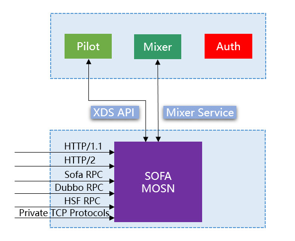
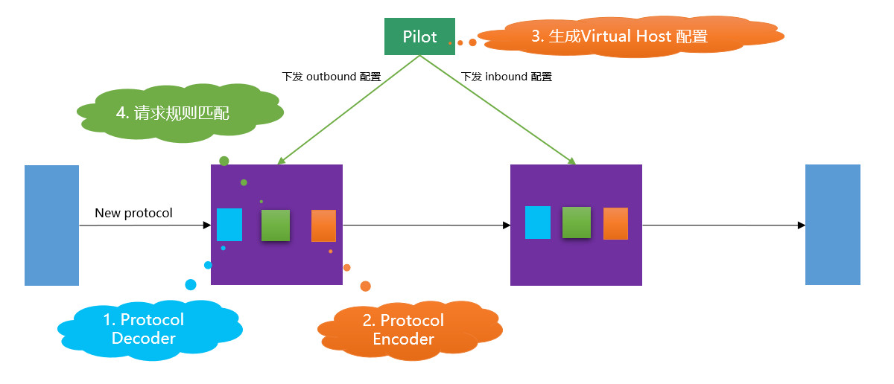
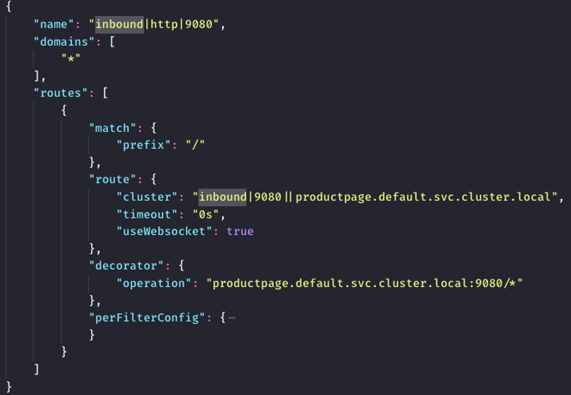
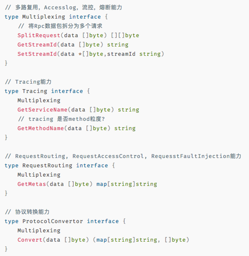

> 本文是SOFAMesh中的多协议通用解决方案x-protocol介绍系列文章之一。
>
> [SOFAMesh中的多协议通用解决方案x-protocol介绍系列（1）——DNS通用寻址方案](/blog/x-protocol-common-address-solution/)
>
> [SOFAMesh中的多协议通用解决方案x-protocol介绍系列（2）——快速解码转发](/blog/x-protocol-rapid-decode-forward/)
>
> [SOFAMesh中的多协议通用解决方案x-protocol介绍系列（3）——TCP协议扩展](/blog/x-protocol-tcp-protocol-extension/)

## 背景

在Istio和Envoy中，对通讯协议的支持，主要体现在HTTP/1.1和HTTP/2上，这两个是Istio/Envoy中的一等公民。而基于HTTP/1.1的REST和基于HTTP/2的gRPC，一个是目前社区最主流的通讯协议，一个是未来的主流，google的宠儿，CNCF御用的RPC方案，这两个组成了目前Istio和Envoy（乃至CNCF所有项目）的黄金组合。

而我们SOFAMesh，在第一时间就遇到和Istio/Envoy不同的情况，我们需要支持REST和gRPC之外的众多协议：

- SOFARPC：这是蚂蚁金服大量使用的RPC协议(已开源)
- HSF RPC：这是阿里集团内部大量使用的RPC协议(未开源)
- Dubbo RPC: 这是社区广泛使用的RPC协议(已开源)
- 其他私有协议：在过去几个月间，我们收到需求，期望在SOFAMesh上运行其他TCP协议，部分是私有协议

为此，我们需要考虑在SOFAMesh和SOFAMosn中增加这些通讯协议的支持，尤其是要可以让我们的客户非常方便的扩展支持各种私有TCP协议：

## 实现分析

我们来大体看一下，在SOFAMesh/Istio中要新增一个通讯协议需要有哪些工作：

1. protocol decoder：负责解析协议，读取协议字段
2. protocol encoder：负责生成请求报文，注意通常会有改动，比如修改某些header
3. 在pilot中需要为新协议生成 Virtual Host 等配置，有 inbound 和 outbound 两份，分别下发到Sidecar
4. 在Sidecar中，根据下发的 Virtual Host 等配置，进行请求匹配，以决定请求该转发到何处

> 备注：实际下发的配置不止 Virtual Host 配置，为了简单起见，我们仅以 Virtual Host 为例做讲解。

其中，protocol encoder和protocol decoder是容易理解的，对于新的通讯协议肯定需要有协议编解码层面的工作必须要完成，这块有工作量是很自然的。

我们来看看第三块的工作量是什么，inbound 和 outbound 的Virtual Host配置示例如下：

outbound 配置中，注意 domains 字段是各种域名和ClusterIP，而 routes 中，match是通过prefix来匹配。我们结合HTTP/1.1，domains字段是用来和请求的Host header进行域名匹配的，比如 `Host: istio-telemetry`，这决定了哪些请求是要转发到 istio-telemetry 这个服务的。routes的match用来进行路由匹配的，通过HTTP请求的path进行匹配。

inbound 配置类似，只是inbound更简单，domains匹配`*`就可以。

从上面的例子中可以看到，Istio和Envoy的设计有非常浓重的HTTP协议的味道，各种语义都是和HTTP直接相关。而当我们进行TCP协议的转发时，就需要将请求的协议字段进行映射，映射到HTTP的相应语义。

比如，最基本的Destination，原始语义是请求的目的地，在前面的文章中我们指出过这是请求转发最关键的字段。在HTTP协议中，通常是通过Host header和Path表示，对于REST而言还有重要的Method字段。

下面的格式是其他各种协议对这个Destination原始语义的实际实现方式：

| 协议      | 实现                                                  |
| --------- | ----------------------------------------------------- |
| 原始语义  | 请求的目的地(Destination)                             |
| HTTP/1.1  | Host header，Method，Path                             |
| HTTP/2    | Header帧中的伪header `:authority`，`:path`和`:method` |
| Bolt协议  | header map中key为”service”的字段                      |
| HSF协议   | 协议头中的服务接口名和服务方法名                      |
| Dubbo协议 | data字段（payload）中的path/method                    |

这些通讯协议在下发规则和进行请求匹配时，就需要进行协调：

- 定义好 Virtual Host 配置中的 domains 字段和 route 中的 match 用到的字段在当前通讯协议中的实际语义
- 在 protocol encoder 中读取请求的协议字段，和上面的字段对应
- 然后进行请求路由规则匹配（参照HTTP/1.1中的domain和route match的匹配）

而这些都是需要以代码的方式进行实现，以满足新通讯协议的要求。正规的做法，是每次新增一个通讯协议就将上述的工作内容重复一遍。这会直接导致大量的高度类似的重复代码。

## x-protocol的实现

在上述需要在协议扩展时修改的四个内容中，有一块是特别的：生成 Virtual Host 配置的工作是在Pilot中实现的，而其他三个是在Sidecar （Envoy或MOSN）中。考虑到 protocol encoder 和 protocol decoder 的工作是必不可少的，必然会修改Sidecar来增加实现代码，因此简化开发的第一个想法就是：能不能做到不修改Pilot？

基本思路就是固定好原始语义，避免每个通讯协议都映射一遍。从前面我们列出来的各个协议的映射情况看，对于RPC协议而言，一般目的地信息都是服务名(有些是接口名)+方法名居多，因此可以考虑直接将服务名和方法名固定下来：

- RPC协议在 Virtual Host 配置中就固定为服务名对应 domains 字段，方法名对应 route 中的 match 用到的字段，这样只要修改一次然后各个RPC协议公用此配置，以后就不用再重复修改Pilot。
- protocol encoder 在解析通讯协议完成之后，就直接将协议中对应服务名和方法名的字段提取出来，后面的匹配处理过程就可以公用一套通用实现，这样路由匹配这块也可以不用在重复开发。

因此，在x-protocol中，如果需要引入一个新的通讯协议，需要的工作内容只有必不可少的protocol encoder 和 protocol decoder，和实现以下几个接口：

## 总结

X-protocol 在支持新通讯协议上的做法并无新奇之处，只是由于需求特殊有众多通讯协议需要支持，在开发时发现大量重复工作，因此我们选择了一条可以让后面更舒服一点的道路。

目前这个方案在SOFAMesh中采用，我们将进一步检验实际效果，也会和合作的小伙伴时验证，看他们在自行扩展新协议时是否足够理想。这个方案理论上应该可以同样适用于Istio、Envoy体系，随着社区对Istio的接受程度的提高，在Istio上支持各种TCP通讯协议的需求会越来越多，有理由相信Istio后续可能也会出现类似的方案。毕竟，每次都改一大堆类似的东西，不是一个好做法。